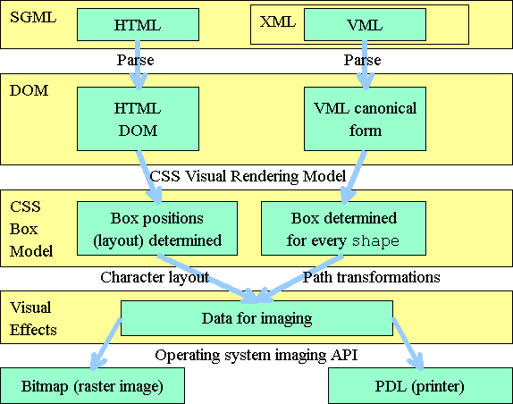
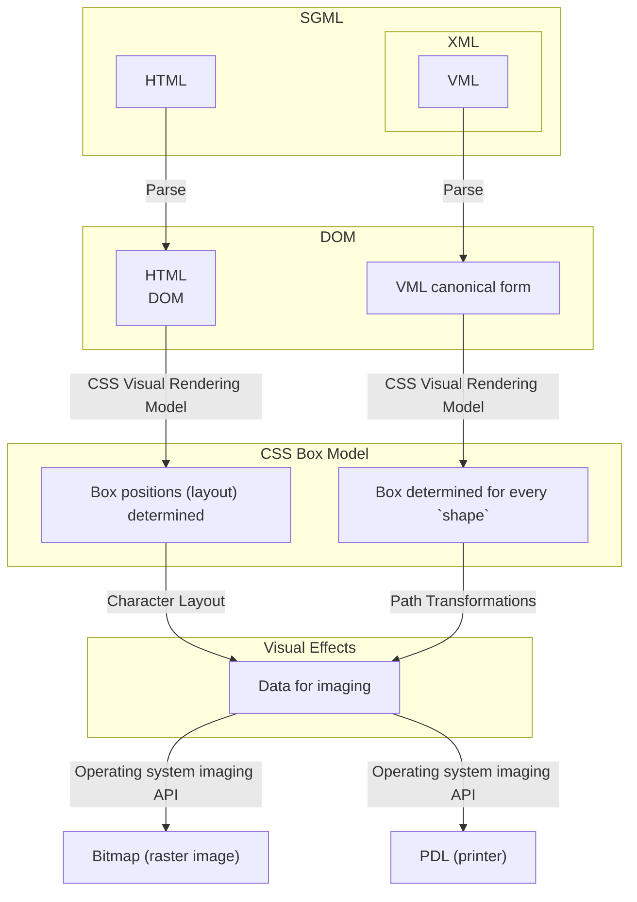
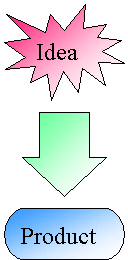
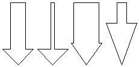
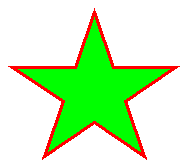

<h4 align="right">
    <a href="http://www.w3.org/">
        <img align="left" alt="W3C" border="0" width="72" height="48" src="data:image/svg+xml;base64,PHN2ZyB3aWR0aD0iNzIiIGhlaWdodD0iNDgiIHZpZXdCb3g9IjAgMCA3MiA0OCIgeG1sbnM9Imh0dHA6Ly93d3cudzMub3JnLzIwMDAvc3ZnIj4KPHBhdGggZmlsbD0iI2ZmZmZmZiIgZD0iTSAwIDAgTCA3MiAwIEwgNzIgNDggTCAwIDQ4IFoiLz4KPHBhdGggZD0iTSAwIDAgTCA3MiAwIEwgNzIgMSBMIDAgMSBaIi8+CjxwYXRoIGQ9Ik0gMCA0NyBMIDcyIDQ3IEwgNzIgNDggTCAwIDQ4IFoiLz4KPHBhdGggZmlsbD0iIzAwNWE5YyIgZD0iTSAyMC4xNDkgOC44MTUgTCAyNS45MDggMjguMzk1IEwgMzEuNjY3IDguODE1IEwgMzUuODM3IDguODE1IEwgNDcuMjggOC44MTUgTCA0Ny4yOCAxMC43NjEgTCA0MS40MDIgMjAuODg4IEMgNDMuNDY3IDIxLjU1MSA0NS4wMjkgMjIuNzU2IDQ2LjA4OCAyNC41MDMgQyA0Ny4xNDcgMjYuMjUgNDcuNjc3IDI4LjMwMiA0Ny42NzcgMzAuNjU4IEMgNDcuNjc3IDMzLjU3MSA0Ni45MDMgMzYuMDIgNDUuMzU0IDM4LjAwNiBDIDQzLjgwNSAzOS45OTIgNDEuNzk5IDQwLjk4NCAzOS4zMzcgNDAuOTg0IEMgMzcuNDgzIDQwLjk4NCAzNS44NjggNDAuMzk1IDM0LjQ5MiAzOS4yMTcgQyAzMy4xMTUgMzguMDM5IDMyLjA5NiAzNi40NDQgMzEuNDM0IDM0LjQzMSBMIDM0LjY5IDMzLjA4MSBDIDM1LjE2NyAzNC4yOTkgMzUuNzk2IDM1LjI1OSAzNi41NzcgMzUuOTYgQyAzNy4zNTggMzYuNjYyIDM4LjI3OCAzNy4wMTIgMzkuMzM3IDM3LjAxMiBDIDQwLjQ0OSAzNy4wMTIgNDEuMzg5IDM2LjM5IDQyLjE1NyAzNS4xNDYgQyA0Mi45MjUgMzMuOTAxIDQzLjMwOSAzMi40MDYgNDMuMzA5IDMwLjY1OCBDIDQzLjMwOSAyOC43MjUgNDIuODk4IDI3LjIyOSA0Mi4wNzggMjYuMTcgQyA0MS4xMjQgMjQuOTI2IDM5LjYyOCAyNC4zMDQgMzcuNTg5IDI0LjMwNCBMIDM2LjAwMSAyNC4zMDQgTCAzNi4wMDEgMjIuMzk4IEwgNDEuNTYyIDEyLjc4NiBMIDM0Ljg1IDEyLjc4NiBMIDM0LjQ2OCAxMy40MzYgTCAyNi4zMDUgNDAuOTg0IEwgMjUuOTA4IDQwLjk4NCBMIDE5Ljk1IDIxLjA0OCBMIDEzLjk5MiA0MC45ODUgTCAxMy41OTUgNDAuOTg1IEwgNC4wNjQgOC44MTUgTCA4LjIzNCA4LjgxNSBMIDEzLjk5MyAyOC4zOTUgTCAxNy44ODYgMTUuMjEgTCAxNS45OCA4LjgxNSBaIi8+CjxwYXRoIGQ9Ik0gNjguOTUyIDguODE1IEMgNjguMTMzIDguODE1IDY3LjM5OCA5LjExIDY2Ljg0MSA5LjY3NiBDIDY2LjI1IDEwLjI3NiA2NS45MjEgMTEuMDUyIDY1LjkyMSAxMS44NTQgQyA2NS45MjEgMTIuNjU2IDY2LjIzNCAxMy4zOTkgNjYuODA4IDEzLjk4MiBDIDY3LjM5MSAxNC41NzMgNjguMTQyIDE0Ljg5NCA2OC45NTMgMTQuODk0IEMgNjkuNzQ2IDE0Ljg5NCA3MC41MTUgMTQuNTczIDcxLjExNCAxMy45OTEgQyA3MS42ODggMTMuNDM0IDcyIDEyLjY5IDcyIDExLjg1NCBDIDcyIDExLjA0MyA3MS42NzkgMTAuMjg0IDcxLjEyMiA5LjcxOCBDIDcwLjUzOSA5LjEyNyA2OS43NzkgOC44MTUgNjguOTUyIDguODE1IFogTSA3MS41OTUgMTEuODggQyA3MS41OTUgMTIuNTgxIDcxLjMyNCAxMy4yMzEgNzAuODI2IDEzLjcxMiBDIDcwLjMwMyAxNC4yMTkgNjkuNjUzIDE0LjQ4OSA2OC45MzUgMTQuNDg5IEMgNjguMjYgMTQuNDg5IDY3LjU5MyAxNC4yMTEgNjcuMDk1IDEzLjcwNCBDIDY2LjU5NyAxMy4xOTggNjYuMzE4IDEyLjU0NyA2Ni4zMTggMTEuODU1IEMgNjYuMzE4IDExLjE2MyA2Ni42MDUgMTAuNDg3IDY3LjEyIDkuOTY0IEMgNjcuNjAxIDkuNDc0IDY4LjI1MSA5LjIxMyA2OC45NiA5LjIxMyBDIDY5LjY4NiA5LjIxMyA3MC4zMzYgOS40ODQgNzAuODQzIDkuOTk4IEMgNzEuMzMzIDEwLjQ4NyA3MS41OTUgMTEuMTQ2IDcxLjU5NSAxMS44OCBaIE0gNjkuMDM3IDEwLjA3MyBMIDY3LjczNyAxMC4wNzMgTCA2Ny43MzcgMTMuNTE4IEwgNjguMzg3IDEzLjUxOCBMIDY4LjM4NyAxMi4wNDkgTCA2OS4wMjkgMTIuMDQ5IEwgNjkuNzMgMTMuNTE4IEwgNzAuNDU2IDEzLjUxOCBMIDY5LjY4NyAxMS45NDcgQyA3MC4xODUgMTEuODQ2IDcwLjQ3MiAxMS41MDggNzAuNDcyIDExLjAxOSBDIDcwLjQ3MiAxMC4zOTQgNjkuOTk5IDEwLjA3MyA2OS4wMzcgMTAuMDczIFogTSA2OC45MTggMTAuNDk1IEMgNjkuNTI2IDEwLjQ5NSA2OS44MDQgMTAuNjY0IDY5LjgwNCAxMS4wODYgQyA2OS44MDQgMTEuNDkxIDY5LjUyNiAxMS42MzUgNjguOTM0IDExLjYzNSBMIDY4LjM4NSAxMS42MzUgTCA2OC4zODUgMTAuNDk1IFoiLz4KPHBhdGggZD0iTSA2My44MzkgOC42MzQgTCA2NC41MTUgMTIuNzQxIEwgNjIuMTI0IDE3LjMxNiBDIDYyLjEyNCAxNy4zMTYgNjEuMjA2IDE1LjM3NSA1OS42ODEgMTQuMzAxIEMgNTguMzk2IDEzLjM5NiA1Ny41NTkgMTMuMTk5IDU2LjI1IDEzLjQ2OSBDIDU0LjU2OSAxMy44MTYgNTIuNjYzIDE1LjgyNiA1MS44MzEgMTguMzA0IEMgNTAuODM2IDIxLjI2OSA1MC44MjYgMjIuNzA0IDUwLjc5MSAyNC4wMjIgQyA1MC43MzUgMjYuMTM1IDUxLjA2OCAyNy4zODQgNTEuMDY4IDI3LjM4NCBDIDUxLjA2OCAyNy4zODQgNDkuNjE3IDI0LjY5OCA0OS42MyAyMC43NjQgQyA0OS42MzkgMTcuOTU2IDUwLjA4MSAxNS40MSA1MS4zOCAxMi44OTcgQyA1Mi41MjMgMTAuNjg4IDU0LjIyMiA5LjM2MiA1NS43MyA5LjIwNiBDIDU3LjI4OSA5LjA0NSA1OC41MjEgOS43OTYgNTkuNDczIDEwLjYxIEMgNjAuNDcyIDExLjQ2NCA2MS40ODMgMTMuMzMgNjEuNDgzIDEzLjMzIFoiLz4KPHBhdGggZD0iTSA2NC4xMzQgMzEuODcyIEMgNjQuMTM0IDMxLjg3MiA2My4wNzcgMzMuNzYxIDYyLjQxOSAzNC40ODkgQyA2MS43NiAzNS4yMTcgNjAuNTgyIDM2LjQ5OSA1OS4xMjcgMzcuMTQgQyA1Ny42NzEgMzcuNzgxIDU2LjkwOSAzNy45MDIgNTUuNDcxIDM3Ljc2NCBDIDU0LjAzNCAzNy42MjYgNTIuNjk4IDM2Ljc5NCA1Mi4yMyAzNi40NDcgQyA1MS43NjIgMzYuMSA1MC41NjYgMzUuMDc4IDQ5Ljg5MSAzNC4xMjUgQyA0OS4yMTUgMzMuMTcxIDQ4LjE1OCAzMS4yNjYgNDguMTU4IDMxLjI2NiBDIDQ4LjE1OCAzMS4yNjYgNDguNzQ3IDMzLjE3NyA0OS4xMTYgMzMuOTg3IEMgNDkuMzI4IDM0LjQ1MyA0OS45OCAzNS44ODEgNTAuOTA2IDM3LjEyMyBDIDUxLjc2OCAzOC4yODIgNTMuNDQ1IDQwLjI3NyA1NS45OTIgNDAuNzI3IEMgNTguNTM5IDQxLjE3OCA2MC4yODkgNDAuMDM0IDYwLjcyMiAzOS43NTYgQyA2MS4xNTUgMzkuNDc5IDYyLjA2OCAzOC43MTUgNjIuNjQ2IDM4LjA5NyBDIDYzLjI0OSAzNy40NTIgNjMuODIgMzYuNjI5IDY0LjEzNiAzNi4xMzUgQyA2NC4zNjcgMzUuNzc1IDY0Ljc0MyAzNS4wNDMgNjQuNzQzIDM1LjA0MyBaIi8+Cjwvc3ZnPgo=" />
    </a>
    NOTE-VML-19980513
</h4>

<br clear="left">

<h1 class="maintitle" align="center" style="text-align: center">
    <a name="h1:vml">Vector Markup Language (VML)</a>
</h1>
<h3 align="CENTER">World Wide Web Consortium Note 13-May-1998</h3>

<h4 align="center" style="text-align: center">Submission to the World Wide Web Consortium</h4>

<!-- # <a name="h1:vml">Vector Markup Language (VML)</a>

## World Wide Web Consortium Note 13-May-1998

#### Submission to the World Wide Web Consortium -->

## <a name="h2:status">Status of this document</a>

This document is a [submission](/Submission/1998/08) to the World Wide Web Consortium.
It is the initial draft of the specification of *VML*.
It is intended for review and comment by W3C members and is subject to change.
There are [W3C Staff comments](/Submission/1998/08/Comment) on this submission.

This document is a NOTE made available by the W3 Consortium for discussion only.
This indicates no endorsement of its content, nor that the Consortium has, is, or will be allocating any resources to the issues addressed by the NOTE.

## <a name="h2:abstract">Abstract</a>

This document defines the Vector Markup Language (VML).
VML is an application of [Extensible Markup Language (XML) 1.0](http://www.w3.org/TR/REC-xml.html) which defines a format for the encoding of vector information together with additional markup to describe how that information may be displayed and edited.
The first part of this document is an introduction, which gives an overview of the way VML is organized and how it interacts with both XML and HTML as defined by the [HTML 4.0 Specification](http://www.w3.org/TR/REC-html40/).
This is followed by detailed technical definition of the behavior of every VML element and the permitted and recommended behaviors for all applications.

The introduction to this document is intended to be appropriate reading for someone who wishes to gain an overview of VML.
The technical specification is intended for authors of application software which might use VML and for people who wish to assess the suitability of VML for a particular application.
It may also be used by people who need to hand-author VML content.
However it is anticipated that most such authoring will proceed by copy and paste of existing VML - VML is intended to be treated in this way.


## <a name="h2:contents">Table Of Contents</a>

- [Introduction to VML](#h2:introduction)
    - [A Simple Example](#h3:introduction.example)
    - [Design Requirements](#h3:introduction.requirements)
    - [Implementation](#h3:introduction.implementation)
- [The Technical Specification of VML](#h2:specification)
    - [Introduction](#_Toc416858380)
    - [Use of CSS](#_Toc416858381)
    - [Local Coordinate Space](#_Toc416858382)
    - [Attribute Types](#_Toc416858383)
    - [DTD Entity Definitions](#_Toc416858384)
    - [Top-Level Elements](#_Toc416858385)
    - [The `shape` Element](#_Toc416858386)
    - [The `shapetype` Element](#_Toc416858387)
    - [The `group` Element](#_Toc416858388)
    - [The `background` Element](#_Toc416858389)
    - [Advanced Properties of Shapes](#_Toc416858390)
    - [The `path` Element](#_Toc416858391)
    - [The `formulas` Element](#_Toc416858392)
    - [The `handles` Element](#_Toc416858393)
    - [The `fill` Element](#_Toc416858394)
    - [The `stroke` Element](#_Toc416858395)
    - [The `shadow` Element](#_Toc416858396)
    - [The `textbox` Element](#_Toc416858397)
    - [The `textpath` Element](#_Toc416858398)
    - [The `imagedata` Element](#_Toc416858399)
    - [Predefined Shapes](#_Toc416858400)
    - [Common Properties of All Predefined Shapes](#_Toc416858401)
    - [The `line` Element](#_Toc416858402)
    - [The `polyline` Element](#_Toc416858403)
    - [The `curve` Element](#_Toc416858404)
    - [The `rect` Element](#_Toc4168584051)
    - [The `roundrect` Element](#_Toc416858405)
    - [The `oval` Element](#_Toc416858406)
    - [The `arc` Element](#_Toc416858407)
    - [The `image` Element](#_Toc416858408)
- [Normative References](#h2:normative)
- [Informative References](#h2:informative)

## <a name="h2:introduction">Introduction to VML</a>

The Vector Markup Language (VML) supports the markup of vector graphic information in the same way that HTML supports the markup of textual information.
Within VML the content is composed of paths described using connected lines and curves.
The markup gives semantic and presentation information for the paths.

VML is written using the syntax of XML just as HTML is written using the syntax of SGML (the Standard Generalized Markup Language, [<a href="#ISO_8879">ISO 8879</a>]) - XML is a restricted form of SGML.
VML uses <a href="http://www.w3.org/TR/PR-CSS2/">Cascading Style Sheets, Level 2</a> in the same way as HTML to determine the layout of the vector graphics which it contains.
The workflow involved in rendering VML can be compared to that involved in rendering HTML as show in the following figure.

<!-- 
Flow chart style diagram:
            HTML(SGML) ->(parse)->
            HTML DOM(DOM) ->(CSS Visual Rendering Model)->
                Box positions (layout) determined (CSS Box Model) ->(Character layout)->
                Data for imaging (Visual Effects) ->(Operating system imaging API)->
                    Bitmap(raster image) OR
                    PDL(printer)
            VML(XML:SGML) ->(parse)->
            VML canonical form ->(CSS Visual Rendering Model)->
                Box determined for every 'shape' ->(Path transformations)->
                Data for imaging (Visual Effects) ->(Operating system imaging API)->
                    Bitmap(raster image) OR
                    PDL(printer)
 -->

<!-- <a name="figure.workflow">
    
</a> -->



The primary difference between the HTML workflow and the VML workflow is in the last but one step - character layout versus path transformations.
In the HTML case, the workflow generates locations and other information for sequences of characters which are then rendered using native operating system functionality.
In the VML, case the workflow generates locations and related information for vector paths and related objects (such as bitmaps) which are then rendered using native operating system functionality.

The common workflow is an essential part of VML - two design requirements were to integrate VML with existing HTML and to avoid requiring a user agent to reinvent the wheel by using different representations or implementations of existing HTML or CSS functionality.

Like HTML, VML describes objects which will often be further edited.
In the case of HTML, these objects are paragraphs, forms or tables.
In the case of VML, the objects are *shapes* or collections of shapes known as *groups*. 
VML does not require a particular approach to editing - it accommodates a wide variety of editors.
The enormous range of graphical data requires that VML pays careful attention to how an editor records the semantic information related to the VML description.
VML ensures that different editors can recognize and correctly handle each other's data (even though they will not normally understand it).

### <a name="h3:introduction.example">A Simple Example</a>

The simple diagram below contains both simple graphics and text.

<a name="figure.simple">
    
</a>

Although the bitmap compression used makes the image very small (it only requires about 8 KB) the bitmap has none of the information necessary to make further changes to the diagram - for example a user who needs to change "Product" to "Products" must recreate the bitmap from scratch.
The corresponding VML has all the necessary editing information in about 2.5 KB.

```css
.font5 {
    color: black;
    font-size: 18.0pt;
    font-weight: 400;
    font-style: normal;
    text-decoration: none;
    vertical-align: text-bottom;
    font-family: "Times New Roman";
}
```

```xml
<v:group
    coordsize="21600, 21600"
    style="position: absolute;
           margin-left: 10.2pt;
           margin-top: 4.8pt;
           width: 90pt;
           height: 191.4pt;
           z-index: 1"
>
    <v:shapetype 
        id="irregularSeal1" 
        coordorigin="17, 8" 
        coordsize="150, 319"
        path="m10800,5800l8352,2295,7312,6320,370,2295,4627,7617,,8615,3722,11775,135,14587,5667,13937,4762,17617,7715,15627,8485,21600,10532,14935,13247,19737,14020,14457,18145,18095,16837,12942,21600,13290,17607,10475,21097,8137,16702,7315,18380,4457,14155,5325,14522,0xe"
    >
        <v:stroke joinstyle="miter" />
        <v:path gradientshapeok="t" textboxrect="4627, 6320, 16702, 13937" />
    </v:shapetype>
    <v:shape type="#irregularSeal1" style="position: absolute; left: 17; top: 8; width: 150; height: 120;" fillcolor="#f06">
        <v:fill type="gradient" color2="fill lighten(0)" method="linear sigma" angle="-135" focus="100%" />
        <v:textbox>
            <div>
                <span class="font5">Idea</span>
            </div>
        </v:textbox>
    </v:shape>
    <v:shapetype id="downArrow" coordsize="21600, 21600" adj="16200, 5400" path="m0@0l@1@0@1,0@2,0@2@0,21600@0,10800,21600xe">
        <v:stroke joinstyle="miter"/>
        <v:formulas>
            <v:f eqn="sum #0 0 0"/>
            <v:f eqn="sum #1 0 0"/>
            <v:f eqn="sum height 0 #1"/>
            <v:f eqn="sum 10800 0 #1"/>
            <v:f eqn="sum width 0 #0"/>
            <v:f eqn="prod @4 @3 10800"/>
            <v:f eqn="sum width 0 @5"/>
        </v:formulas>
        <v:path textboxrect="@1, 0, @2, @6"/>
        <v:handles>
            <v:h position="#1, #0" xrange="0, 10800" yrange="0, 21600" />
        </v:handles>
    </v:shapetype>
    <v:shape  type="#downArrow" adj="11632, 4371" fillcolor="#6f9" style="position: absolute; left: 40; top: 143; width: 105; height: 105;">
        <v:fill type="gradientScale" color2="fill lighten(0)" method="linear sigma" angle="-135" focus="100%" />
    </v:shape>
    <v:shapetype id="flowChartTerminator" coordsize="21600, 21600" v="m3475,0qx0,10800qy3475,21600l18125,21600qx21600,10800qy18125,0xe">
        <v:stroke joinstyle="miter"/>
        <v:path gradientshapeok="t" textboxrect="1018, 3163, 20582, 18437"/>
    </v:shapetype>
    <v:shape type="#flowChartTerminator" style="position: absolute; left: 17; top: 263; width: 150; height: 64" fillcolor="#39f">
        <v:fill type="gradient" color2="fill lighten(0)" method="linear sigma" angle="-135" focus="100%"/>
        <v:textbox>
            <div>
                <span class="font5">Product</span>
            </div>
        </v:textbox>
    </v:shape>
</v:group>
```

This VML contains all the information required both to edit and to display the diagram.
The VML has been color coded as follows:

<font color="#0000FF">Blue</font> - XML structure.

VML is formatted according to
the rules of XML.
The v: prefix on each VML tag identifies the tag as VML, following
the current suggestion for handling namespaces in XML.
Any standard XML parser can
parse the VML and hand off the resultant data to a VML specific processor.

<font color="#008000">Green</font> - CSS information.

The first block of CSS is
used in the HTML which defines the text in the diagram - this is just standard CSS.
Each `shape` and `group` element has a CSS style attribute which
defines the position and size of the shape within the page.
The location of the
top-level group is defined completely by the CSS - a layout engine need not understand any
aspect of VML to handle this positioning information.

Black - VML.

The remainder of the data describes the graphical properties of the diagram.
Notice how this data is associated with the `shape` and `shapetype`
elements.
The `shape` elements are rendered in the diagram, the `shapetype`
elements allow reuse of geometric information between shapes.
In this case, because
there are three different shapes in the diagram, there are also three `shapetype`
elements, but in more complex cases the same shape would be used multiple times (each
instance referencing the same `shapetype` element).

<font color="#804000">Brown</font> - HTML text.

This text is associated with `shape` elements in the diagram.
The VML in *italics* controls the location of the HTML text.

<font color="#800080">Purple</font> - the most basic VML geometric information

describes closed or open paths.
These paths may be parameterized - this allows a
single `shapetype` element to define multiple related paths.
For example,
the `downArrow` shapetype above is defined parametrically and the following
four arrows all share the same basic shape.

<a name="figure.arrows">
     
</a>

The corresponding VML is:

```xml
<v:shape 
    type="#downArrow"
    style='position: absolute; left: 77; top: 16; width: 64; height: 128'
/>
<v:shape 
    type="#downArrow"
    style='position: absolute; left: 149; top: 16; width: 64; height: 128'
    adj=", 9450"
/>
<v:shape 
    type="#downArrow"
    style='position: absolute; left: 219; top: 16; width: 64; height: 128'
    adj="14175, 2025"
/>
<v:shape 
    type="#downArrow"
    style='position: absolute; left: 292; top: 16; width: 64; height: 128'
    adj="7088, 7425"
/>
```

The combination of parameterization with a concise path description allows VML diagrams to be relatively compact, despite the large amount of editing information.
Indeed, large VML diagrams become dominated by the CSS required to position the elements.
VML defines a defaulting mechanism for CSS which allows the container box to be inherited in order to avoid this overhead on complex illustrations.

### <a name="h3:introduction.requirements">Design Requirements</a>

Many requirements guided the design of VML.
The most crucial are listed below in order of importance.


<ol>
    <li>
        Retain the information required for further editing of VML.
        This requirement has the important consequence that VML must be extensible - it is inconceivable that VML meets
        the requirements of all editing applications, therefore it must be possible for every
        application to add the required editing data specific to that application.
    </li>
    <li>
        Support interchange of data between applications.
        One application must be able to read and edit the data of another application, even though the first requirement means that, potentially, both applications will add application specific data.
    </li>
    <li>
        Use the existing mechanisms of HTML and CSS - this facilitates implementation of VML and ensures that implementations can reuse existing code and techniques.
    </li>
    <li>
        Be backward compatible with existing user agents.
        VML adoption will be inhibited unless it is possible to produce VML which works with existing web browsers.
        VML has special provisions to allow alternate bitmap representations of graphics for backward compatibility.
    </li>
    <li>
        Provide efficient representations of vector graphics.
        Textual representations tend to be verbose.
        VML addresses this by defining a compact representation of path
        elements and by following a design principle of using concise names for frequently used
        attributes and more verbose names for less frequently used attributes.
    </li>
    <li>
        Allow the implementation of subsets where an application does not require the full functionality of VML.
        Normally a viewer will implement the full specification, however editors should be able to implement only the subset required for their own data.
    </li>
    <li>
        Support hand-editing.
        This leads to a design principle that the structure of the
        graphic be obvious and that the syntax be familiar to HTML programmers - effectively the
        same as requirement (3).
    </li>
    <li>
        VML should support scripting, including the requirements of animation.
        This, again, leads to a desire for the structure of VML to match the structure of the graphics.
        It also leads to the use of types within VML attributes which are appropriate to animation - for example 2D coordinates are defined as single attributes "x, y" rather than pairs of attributes.
    </li>
</ol>

### <a name="h3:introduction.implementation">Implementation</a>

An implementation of VML will fall into one of two classes.
A *viewer* implementation will normally implement the full specification, although it can avoid the need to implement any functionality to edit VML (beyond that required by any script language which the viewer supports).
An *editor* implementation may only need to implement those specific features necessary to output the data which the editor manipulates.
Even an editor which potentially manipulates VML produced by other applications may need nothing more than a subset of the CSS2 visual rendering model.
Such an editor can correctly position the VML produced by other applications even though it may not be able to render individual shapes.

The implementation model follows the [diagram](#figure.workflow) at the start of this document.
An implementation can proceed in five separate, independent, steps.


1. Each implementation requires an XML parser.<br/>This performs lexical analysis of VML and identifies the individual elements.<br/>XML parsers are already widely available.
1. Non-trivial implementations will need to parse the structure of the individual VML attributes.<br/>To make this easy, VML defines basic types which have canonical internal representations - no VML implementation is required to store greater accuracy than that implied by the canonical representation and all VML data can be converted to the corresponding representations.<br/>This means that the implementor need only write a small number of string parsers to be able to handle all VML data.<br/>Most of these parsers are already present either as part of language libraries or as a consequence of the need to parse CSS.
1. An implementation must handle that part of the CSS2 visual rendering model used by VML.<br/>VML uses a small subset of CSS2 to define the block level boxes for each VML element.<br/> Implementing this gives a minimal VML implementation which can handle the layout of elements (using their block level boxes) without doing any rendering.
1. Viewing implementations and most editing implementations must handle the path parameterization required by VML - a small set of mathematically defined transformations allow the VML representation of a path to be reduced to a simple set of closed or open line segments.<br/> Extensions to VML may add transformations, however VML allows such extensions to be accompanied by equivalent definitions of the same information in unextended VML.
1. Finally the implementation must render the path level data in the way specified by the VML rendering attributes.<br/> Normally this operation maps easily onto widely available operating system facilities.


Each of these five steps is testable in isolation and implementable independently of the other steps.
Only steps (2) and (4) are VML specific, and step (2) can reuse standard technology available in many places.


<hr/>

## <a name="h2:specification">The Technical Specification of VML</a>

### <a name="_Toc416858380">Introduction</a>

The overall structure of VML may be summarized by the XML definitions of the two primary elements - `shape` and `group`.

A `shape` element is used to define a visible vector graphic element.
Most shapes have a *path* definition - a sequence of straight lines and cubic bézier curves which defines an outline.
The outline may be *stroked*, as specified by attributes on the shape and the `stroke` sub-element.
It may also be *filled*, under the control of shape attributes and the `fill` sub-element.
Additional sub-elements support raster (bitmap) images, more advanced
transformations of the path and text drawn on top of the shape.

Below is an example of a simple shape and its VML representation.



```xml
<v:shape 
    style='top: 0; left: 0; width: 250; height: 250'
    stroke="true" 
    strokecolor="red" 
    strokeweight="2" 
    fill="true"
    fillcolor="green" 
    coordorigin="0 0" 
    coordsize="175 175"
>
    <v:path v="m 8,65l 72,65,92,11,112,65,174,65,122,100,142,155,92,121,42,155,60,100x e"/>
</v:shape>
```

A `group` element is used to group together several shapes so that they may
be transformed together as one unit.

In addition VML defines several auxiliary top-level elements to help make the editing
and representation of complex graphical information more compact and convenient.

The `shapetype` element is used to define a prototype definition of a shape.
A `shape` element may reference a `shapetype` in order to instantiate several copies of the same shape.

Several predefined shapes may be used as convenient alternatives to explicitly declaring a shape element with a path.
These predefined shapes are `line`, `polyline`, `curve`, `rect`, `roundrect`, `oval`, `arc`, and `image`.

### <a name="_Toc416858381">Use of CSS</a>

The style attribute uses the syntax described in ["Visual rendering model"](http://www.w3.org/TR/WD-CSS2/visuren.html#visual-rendering-model) in [Cascading Style Sheets, Level 2](http://www.w3.org/TR/WD-CSS2/).
The positioning may be absolute or relative unless the shape is within a group, in which case it must be absolute (relative to the top left of the parent group). 
The z order of the elements within the group is from the first (lowest) to the last (highest) - i.e. later elements obscure earlier elements.
The elements establish no relative position - hence the restriction to use of absolute positioning.

The VML `shape` and `group` elements participate fully in the CSS2 visual rendering model.
In addition to standard CSS layout the VML elements may also be rotated or flipped.
Each element also establishes a coordinate space for its content - this allows scaling of the content with respect to the containing elements. 
The following VML specific CSS properties support this.

`rotation`

The value specifies a rotation for the shape or group in clockwise degrees about its
    center (i.e. positive is clockwise, negative is counterclockwise - the normal definition
    in an inverted coordinate space).

`flip`

The value specifies that the shape or group is flipped about its center about either the x or the y axis according to the following table.

| Value |                         Description                          |
| ----- | ------------------------------------------------------------ |
| x     | Flip the rotated shape about the y axis (invert x ordinates) |
| y     | Flip the rotated shape about the x axis (invert y ordinates) |

Both `x` and `y` may be specified in the flip property.

`center-x`, `center-y`

These properties may be used to specify the center of the block level box of the element within its parent container box.
They are alternatives to `left` and `right` and convey the same information.
It is an error to specify both `left` and `center-x`.
A user agent should respond to the error by honoring `center-x` (or `center-y`).
The user agent may issue a diagnostic to the user if this is appropriate. 

#### <a name="_Toc416858382">Local Coordinate Space</a>

The `shape` and `group` elements are containing blocks for their content - they define a CSS2 "block level box".
Inside the containing block a local coordinate system is defined for any sub-elements using the `coordsize` and `coordorigin` attributes.
All CSS2 positioning information is expressed in terms of this local coordinate space.
Consequently CSS2 position attributes (`left`, `top`, `width`, `height` and so on) have no unit specifier - they are simple numbers, not CSS length quantities.

The `coordsize` attribute defines how many units there are along the width of the containing block. 
The `coordorigin` attribute defines the coordinate at the top left corner of the containing block.

For example, if a group were defined as follows:

```xml
<v:group 
    style='width: 300px; height: 250px' 
    coordsize="1000,1000" 
    coordorigin="-500,-500" 
/>
```

The containing block would be 300 pixels wide by 250 pixels high (assume that the parent element of this group was not another group).
Then the coordinate system inside the containing block would range from `–500.0` to `500.0` along the x-axis and `–500.0` to `500.0` along the y-axis with `0.0`, `0.0` right in the center of the rectangle.
Any shapes inside the group are positioned and sized according to this local coordinate system.
No matter how the width and height of the group is changed, the local coordinate system inside will remain the same.

The rationale behind this is that the vectors defining a shape can be specified in a local coordinate system.
If the containing block for the shape is changed, the outline of the shape will be automatically scaled to the new box. 
Similarly, shapes within the local ordinate system of a group will be automatically scaled if the containing block of the group changes.

It is important to note that the containing block does **not** establish a clipping region.
Sub-elements and paths may be drawn outside the boundaries of the containing block.
The containing block merely serves to map the local coordinate space to the page space.

### <a name="_Toc416858383">Attribute Types</a>

Basic types of attributes are identified according to their lexical form as follows.

| Data Type |                                                                                                   Description                                                                                                   |
| --------- | --------------------------------------------------------------------------------------------------------------------------------------------------------------------------------------------------------------- |
| boolean   | An attribute which can take values true and false.                                                                                                                                                              |
| string    | Character data of any length. Normally string attributes have a restricted range of defined values (as in CSS.)                                                                                                 |
| number    | Numeric data, used for values that are integer or fractional numbers and for values which specify lengths. Lengths and numbers follow the lexical form defined for CSS with a suffix indicating a scale factor. |
| Vector2D  | Numeric data in the form X,Y. Usually used to list a coordinate in 2D space. May be in form `"x y" `or `"x, y"                                                                                                     `|
| Vector3D  | Numeric data in the form X,Y,Z. Usually used to list a coordinate in 3D space. May be in the form `"x y z" `or `"x,y,z"                                                                                            `|

A complete set of data types is defined for VML along with canonical representations which ensure that the minimum precision which an authoring tool must store and the maximum which it can rely on are well defined.
At this stage the tables in this document do not give the underlying data types.

### <a name="_Toc416858384">DTD Entity Definitions</a>

VML shape elements (`shape` and `group` and the predefined shapes) use the standard HTML core attributes plus some attributes which may appear on any element. 

```
<!entity %coreattrs
    id          id     #implied -- document-wide unique id --
    class       cdata  #implied -- space separated list of classes --
    style       cdata  #implied -- associated style info --
    title       cdata  #implied -- advisory title/amplification –-
    href        cdata  #implied -- URL link if the element is clicked on --
    target      cdata  #implied -- target frame for href –-
    alt         cdata  #implied -- alternate text if element cannot be displayed --
    coordsize   cdata  #implied –- size of coordinate space inside the element --
    coordorigin cdata  #implied -- coordinate at top-left corner of element --
    wrapcoords  cdata  #implied -- outline to use for tight text wrapping --
>
```

In addition shape elements and the special pre-defined elements have standard attributes to control rendering.

```
<!entity %shapeattrs
    opacity      cdata #implied -- opacity of the shape --
    chromakey    cdata #implied –- color to be made transparent --
    stroke       cdata #implied -- Boolean whether to stroke the outline or not --
    strokecolor  cdata #implied –- RGB color to use for the stroke --
    strokeweight cdata #implied –- weight of the line to use for stroking --
    fill         cdata #implied -- Boolean whether to fill the shape or not --
    fillcolor    cdata #implied –- RGB color to use for the fill --
    print        cdata #implied -- Boolean whether the element is to be printed --
>
```

Sub-elements are used within shape elements to define more sophisticated rendering operations.

```
<!entity %shape.elements
    (path | formulas | handles | fill | stroke | shadow | textbox | textpath | imagedata | %extensions;)
>

<!attlist shape %coreattrs; %shapeattrs;
    type cdata #implied -- reference to shapetype --
    adj  cdata #implied -- list of adjust values for parameterized paths --
    path cdata #implied -- string with command set describing a path --
>
```

At most one instance of each sub-element may occur in a shape element.
If multiple elements do occur the user agent should respond to the error by merging the repeated elements and retaining only the last values specified if the same attribute is specified more than once. 
The user agent may also issue a diagnostic if appropriate.

The entity `%extensions;` acts as a placeholder for future extensions.
Any extension element may be qualified by the `v:ext` attribute.

```
<!attlist (%extensions;)
    v:ext cdata "backwardcompatible" -- may also be "view" or "edit" --
>
```

When an authoring agent encounters such an element the `v:ext` attribute tells it how to handle the extension.

|    `v:ext` value     |                                                                          Element interpretation                                                                           |                                     Viewer behavior                                      |                                                 Editor behavior                                                  |
| -------------------- | ------------------------------------------------------------------------------------------------------------------------------------------------------------------------- | ---------------------------------------------------------------------------------------- | ---------------------------------------------------------------------------------------------------------------- |
| `edit`               | The element contains high level semantic information which was used by the original content generator. The information should not be removed from the shape.              | The element content can be ignored.                                                      | The element content can be ignored, it need not be removed however it must not be duplicated.                    |
| `backwardcompatible` | The element contains information from the original content generator which does not affect the appearance of the shape but which must be changed if the shape is changed. | The element content can be ignored.                                                      | The element content can be ignored unless the shape is edited, in which case the element must be removed.        |
| `view`               | The element contains information which changes the appearance of the shape from that implied by VML.                                                                      | The element cannot be displayed, the viewer must use the alternate `IMG` representation. | The element content can be ignored unless the shape is edited. The VML information can be used as a placeholder. |

These rules give an editor application the ability to edit any VML document.
If an editor just changes the document layout it can still handle even `v:ext="view"` extensions - the VML definition ensures that the editor knows the CSS layout properties of the shape.
The rules accommodate a wide variety of editor behavior - an editor might chose to lock an extended shape to prevent invalidation of the extension information for example.

### <a name="_Toc416858385">Top-Level Elements</a>

#### <a name="_Toc416858386">The <code>shape</code> Element</a>

This is the top-level element used to describe a shape. 
This element may appear by itself or within a `<group>` element. 
If a `<shapetype>` is referenced using the `type=attribute`, any attributes specified in the shape will override those found in the `shapetype`.

```
<!element shape (%shape.elements;)* >

<!attlist shape %coreattrs; %shapeattrs;
    type cdata #implied -- reference to shapetype --
    adj  cdata #implied -- list of adjust values for parameterized paths --
    path cdata #implied -- string with command set describing a path --
>
```

The path definition is described in more detail below.
Path parameterization allows one canonical path to describe a range of shapes which differ only in geometric proportions (for example, ring shapes where the ratio of the inner to the outer circle diameter varies).

##### Attribute Descriptions.

| Name Space |            Attribute             |   Type   | Default Value |                                                                                                                                                     Description                                                                                                                                                     |
| ---------- | -------------------------------- | -------- | ------------- | ------------------------------------------------------------------------------------------------------------------------------------------------------------------------------------------------------------------------------------------------------------------------------------------------------------------- |
| VML        | id                               | string   | null          | A unique ID that identifies the shape. Used by script to reference the shape in a collection.                                                                                                                                                                                                                       |
| VML        | type                             | string   | null          | A reference to a shapetype `id` that describes the standard path, fill and stroke properties of a shape.  Properties specified in the shape will override the shapetype properties.                                                                                                                                 |
| VML        | adj                              | string   | null          | A comma delimited list of numbers that are the parameters for the guide formulas that define the path of the shape. Values may be omitted to allow for using defaults. There can be up to 8 adjust values.                                                                                                          |
| VML        | path                             | string   | null          | A string containing the commands that define the path. (See path element for definition of the command set).                                                                                                                                                                                                        |
| VML        | href                             | string   | null          | The URL to jump to if this shape is clicked on.                                                                                                                                                                                                                                                                     |
| VML        | target                           | string   | null          | The target frame in a URL                                                                                                                                                                                                                                                                                           |
| VML        | class                            | string   | null          | The CSS class of this shape                                                                                                                                                                                                                                                                                         |
| VML        | title                            | string   | null          | The title of the shape that may be displayed by editors                                                                                                                                                                                                                                                             |
| VML        | alt                              | string   | null          | Alternative text associated with the shape.                                                                                                                                                                                                                                                                         |
| CSS        | visibility                       | string   | visible       | If `"hidden"` the shape is not rendered and does not generate mouse events.                                                                                                                                                                                                                                         |
| CSS        | top, margin-top, center-y, etc   | number   | 0             | The position of the top of the containing block of the shape.  In CSS units or, for elements in a group, in the coordmap units of parent element.  This may be specified by any of the CSS mechanisms for locating a container box.                                                                                 |
| CSS        | left, margin-left, center-x, etc | number   | 0             | The position of the left of the containing block of the shape.  In CSS units or, for elements in a group, in the coordmap units of parent element.  This may be specified by any of the CSS mechanisms for locating a container box.                                                                                |
| CSS        | width                            | number   | 100           | The width of the container rectangle of the shape.  In CSS units or, for elements in a group, in the coordmap units of parent element.                                                                                                                                                                              |
| CSS        | height                           | number   | 100           | The height of the containing block of the shape.  In CSS units or, for elements in a group, in the coordmap units of parent element.                                                                                                                                                                                |
| CSS        | z-index                          | number   | 0             | The z-index of the shape. Positive numbers are in front of the screen. Negative numbers are behind the screen.                                                                                                                                                                                                      |
| CSS        | rotation                         | number   | 0             | The angle to rotate the reference rectangle.  Zero degrees means no rotation.   Positive angles are clockwise (because positive y-axis is down.)                                                                                                                                                                    |
| CSS        | flip                             | string   | null          | Takes values "x" or "y" or both.  Indicates that the shape image inside the reference rectangle should be flipped as appropriate along the listed axes in the order specified. i.e. flip: x means flip about the y-axis so that x becomes -x.                                                                       |
| CSS        | position                         | string   | static        | May be any CSS value when this is a top-level element. When it is contained inside a group, it must always be `absolute`.                                                                                                                                                                                           |
| VML        | opacity                          | number   | 1             | The opacity of the entire shape. A fraction between 0 (completely transparent) and 1 (completely opaque.)                                                                                                                                                                                                           |
| VML        | chromakey                        | color    | null          | A color value that will be transparent and show anything behind the shape.                                                                                                                                                                                                                                          |
| VML        | stroke                           | boolean  | TRUE          | If `true`, the path defining the shape will be stroked. By default, it will be stroked using a solid line unless there is a `stroke` sub-element which may specify more complex stroke properties. The stroke sub-element has an `on` attribute which will override this if specified.                              |
| VML        | strokecolor                      | color    | black         | The primary color of the brush to use to stroke the path of this shape. The stroke sub-element has a "color" attribute which will override this if specified.                                                                                                                                                       |
| VML        | strokeweight                     | number   | 0.75pt        | The width of the brush to use to stroke the path. The stroke sub-element has a "weight" attribute which will override this if specified.                                                                                                                                                                            |
| VML        | fill                             | boolean  | TRUE          | If "true", the path defining the shape will be filled. By default, it will be filled using a solid color unless there is a `<fill>` sub-element that specifies more complex fill properties. If "false", the fill is transparent. The fill sub-element has an "on" attribute which will override this if specified. |
| VML        | fillcolor                        | color    | white         | The primary color of the brush to use to fill the path of this shape. The fill sub-element has a "color" attribute which will override this if specified.                                                                                                                                                           |
| VML        | v                                | string   | null          | A string containing the commands that define the `path` - see the description of the path element for more information.  X or Y coordinate values can be a reference to a formula in the form *@number* where *number* is the formula's ordinal number, e.g., `"@2"`.  See the `formula` element.                     |
| VML        | print                            | boolean  | TRUE          | If `true`, this shape should be printed.                                                                                                                                                                                                                                                                            |
| VML        | coordsize                        | Vector2D | 1000 1000     | The width and height of the coordinate space inside the containing block of this shape. If it is not specified, it is the same as the width and height of the rectangle.                                                                                                                                            |
| VML        | coordorigin                      | Vector2D | 0 0           | The coordinates at the top-left corner of the containing block.                                                                                                                                                                                                                                                     |
| VML        | wrapcoords                       | string   | null          | In the form "x1,y1,x2,y2,x3,y3…" (same as coords in an `AREA`). Describes in drawing units around a shape. Used for the tight wrapping of text around an object.                                                                                                                                                    |

##### XML template

Throughout this document *XML templates* are used to summarize the full set of attributes which may appear on each element.
The shape elements - `shape`, `group` and most of the predefined shapes have CSS2 positioning information which locates the shape within its container.
This is not reflected in the templates as there are several different ways of specifying the same information.
A top-level shape will typically use `absolute` positioning plus `margin-left` and `margin-top` properties:

- `style='position: absolute; margin-left: 10pt; margin-top: 10pt; width: 100pt; z-index: 1.5;'`

A shape within a group can use `left`/`top` or `center-x`/`center-y` as appropriate:

- `style='left: 100; top: 100; width: 1000; height: 1000'`
- `style='center-x: 550; center-y: 550; width: 1000; height: 1000; rotation: 55deg'`

The `rotation`, `z-index` and `flip` properties may also be given when required.

```
<shape
    type=null
    adj=null
    path=null
    opacity="100%"
    chromakey="none"
    stroke="true"
    strokecolor="black"
    strokeweight="0.75pt"
    fill="true"
    fillcolor="white"
    print="true"
    id=null
    class=null
    style='visibility: visible'
    title=null
    href=null
    target=null
    alt=null
    coordsize="1000, 1000"
    coordorigin="0, 0"
    wrapcoords=null
/>
```

#### <a name="_Toc416858387">The <code>shapetype</code> Element</a>

##### Description

This is the element used to describe a shape so that it may be referenced at a later
point in the document by a `shape` element.
It is identical to the `shape`
element except that it cannot reference another `shapetype` element and that
the `visibility` property is always `hidden`.
(Authoring
agents may choose to make `shapetype` elements visible to allow them to be
edited - in this case the CSS positioning properties become relevant.)

When a `shape` element makes reference to a `shapetype`, the `shape` may duplicate some of the attributes that have already been specified in the `shapetype`.
In these cases, the attributes in the `shape` override those of the `shapetype.`

```
<!element shapetype (%shape.elements;)* >

<!attlist shapetype %coreattrs; %shapeattrs;
    adj  cdata #implied -- list of adjust values for parameterized paths --
    path cdata #implied -- string with command set describing a path --
>
```

##### Attribute Descriptions

See `shape`.

##### XML Template

```
<shapetype
    adj=null
    path=null
    opacity="100%"
    chromakey="none"
    stroke="true"
    strokecolor="black"
    strokeweight="0.75pt"
    fill="true"
    fillcolor="white"
    print="true"
    id=null
    class=null
    style='visibility: visible'
    title=null
    href=null
    target=null
    alt=null
    coordsize="1000, 1000"
    coordorigin="0, 0"
    wrapcoords=null
/>
```

#### <a name="_Toc416858388">The <code>group</code> Element</a>

This top-level element is used to group shapes (including other groups) so that they can be positioned and transformed as a single unit.

```
<!element group
    (group | shape | shapetype | line | polyline | curve | rect | roundrect | oval | arc | image)*
>

<!attlist group %coreattrs; >
```

##### Attribute Descriptions

See `<shape>` for the descriptions of the following attributes: 
- `id`
- `class` 
- `style` (`top`, `left`, `width`, `height`, `rotation`, `z-index`, `position`, `visibility`)
- `title`
- `href`
- `target`
- `alt`
- `coordsize`
- `coordorigin`

##### XML template

```
<group
    id=null
    class=null
    style='visibility: visible'
    title=null
    href=null
    target=null
    alt=null
    coordsize="1000, 1000"
    coordorigin="0, 0"
    wrapcoords=null
/>
```

#### <a name="_Toc416858389">The <code>background</code> Element</a>

##### Description

This element describes the fill of the background of a page using vector graphics fills.
This illustrates how the rendering description of VML can be extended to existing and new HTML objects.

```
<!element background (fill) >

<!attlist background
    id        id    #implied -- document-wide unique id --
    fill      cdata #implied -- Boolean whether to fill the shape or not --
    fillcolor cdata #implied –- RGB color to use for the fill --
>
```

##### Attribute Descriptions

See `<shape>` for the descriptions of `id`, `fill` and `fillcolor`.

##### XML template

```
<background
    id=null
    fill="true"
    fillcolor="white"
/>
```

### <a name="_Toc416858390">Advanced Properties of Shapes</a>

The following sub-elements may be used to describe more advanced properties of shapes.
For example, the shape element only allows the description of a solid color fill. 
One would use the `fill` sub-element to describe a gradient fill.

#### <a name="_Toc416858391">The <code>path</code> Element</a>

This sub-element may appear inside a `shape` or a `shapetype` to define the path that makes up the shape. 
This is done through a string that contains a rich set of pen movement commands.
This sub-element also describes the *limo-stretch* point, inscribed textbox rectangle locations, and connection site locations.
The limo-stretch definition and the `formulas` element (described below) allow greater designer control of how the path scales.
They allow, for example, definition of a true rounded corner rectangle where the corners remain circular even though the rectangle is scaled anisotropically.

```
<!element path (null)>

<!attlist path
    id              id    #implied -- document-wide unique id --
    v               cdata #implied -- string containing pen movement commands --
    limo            cdata #implied -- point to do a limo stretch --
    fillok          cdata #implied -- path may be filled --
    strokeok        cdata #implied -- path may be stroked --
    shadowok        cdata #implied -- path may be used to create a shadow --
    arrowok         cdata #implied -- arrowheads may be drawn on path --
    gradientshapeok cdata #implied -- how to interpret gradientradial --
    textpathok      cdata #implied -- path is designed for use with textpath --
    textboxrect     cdata #implied -- rectangle to hold label text --
>
```

##### Properties

<table border="3">
    <tbody>
        <tr>
            <td>Name Space</td>
            <td>Attribute</td>
            <td>Type</td>
            <td>Default Value</td>
            <td>Description</td>
        </tr>
        <tr>
            <td>VML</td>
            <td>id</td>
            <td>string</td>
            <td>null</td>
            <td>A unique ID that identifies the shape. Used by script to reference the shape in a
                collection.</td>
        </tr>
        <tr>
            <td>VML</td>
            <td>v</td>
            <td>string</td>
            <td>null</td>
            <td>A string containing the commands that define the path. (See below for definition of
                the command set).</td>
        </tr>
        <tr>
            <td>VML</td>
            <td>limo</td>
            <td>vector2D</td>
            <td>"0,0"</td>
            <td>A point along the x and y dimensions of a shape where the shape will limo stretch.</td>
        </tr>
        <tr>
            <td>VML</td>
            <td>fillok</td>
            <td>boolean</td>
            <td>true</td>
            <td>If set the path may be filled, if unset any fill specification on the path should be
                ignored</td>
        </tr>
        <tr>
            <td>VML</td>
            <td>strokeok</td>
            <td>boolean</td>
            <td>true</td>
            <td>If set the path may be stroked, if unset any stroke specification on the path should
                be ignored</td>
        </tr>
        <tr>
            <td>VML</td>
            <td>shadowok</td>
            <td>boolean</td>
            <td>true</td>
            <td>If set a shadow path may be created from the path, if unset any shadow specification
                should be ignored.</td>
        </tr>
        <tr>
            <td>VML</td>
            <td>arrowok</td>
            <td>boolean</td>
            <td>false</td>
            <td>If set arrowheads may be added to the ends of the path, if unset any arrowheads
                specified in the <code>stroke</code> element should be ignored.</td>
        </tr>
        <tr>
            <td>VML</td>
            <td>gradientshapeok</td>
            <td>boolean</td>
            <td>false</td>
            <td>If set a gradient fill can be produced by repeated drawing of scaled versions of the
                path - this must only be set if it is possible to scale the path in such a way that a fill
                is always contained in the original path.
                This controls the interpretation of the <code>fill</code>
                element <code>type="gradientradial"</code> attribute setting.</td>
        </tr>
        <tr>
            <td>VML</td>
            <td>textpathok</td>
            <td>boolean</td>
            <td>false</td>
            <td>If set this indicates that the path is an appropriate warping path for the <code>textpath</code>
                element.
                If not set the <code>textpath</code> element must be ignored.&nbsp;
                Normally textpath paths are not useful unless they are associated with a <code>textpath</code>
                element.</td>
        </tr>
        <tr>
            <td>VML</td>
            <td>textboxrect</td>
            <td>string</td>
            <td>null</td>
            <td>A string of the form "L1,T1,R1,B1; L2,T2,R2,B2;…" If the string is
                null, then the textbox is set equal to the geometry box. In practice 1, 2, 3 or 6 text
                rectangles may be specified. Detail on how more than one rect is used, is specified
                elsewhere. The left, top, right, or bottom values can be a reference to a formula in the
                form <code>@<em>number</em></code> where <em><code>number</code></em> is the
                formula's ordinal number.
                The default is the same as the containing block.</td>
        </tr>
    </tbody>
</table>

The `v` attribute string (or the `path` property of `shape`) is made up of a rich set of commands as summarized in the following table:

<table border="3">
    <tbody>
        <tr>
            <td align="center"><a name="table.path.commands">command</a></td>
            <td align="center">Name</td>
            <td align="center">parameters</td>
            <td align="center">Description</td>
        </tr>
        <tr>
            <td><b><code>m</code></b></td>
            <td><code>moveto</code></td>
            <td>2</td>
            <td>Start a new sub-path at the given (x,y) coordinate</td>
        </tr>
        <tr>
            <td><b><code>l</code></b></td>
            <td><code>lineto</code></td>
            <td>2*</td>
            <td>Draw a line from the current point to the given (x,y) coordinate which becomes the new
                current point. A number of coordinate pairs may be specified to form a polyline.</td>
        </tr>
        <tr>
            <td><b><code>c</code></b></td>
            <td><code>curveto</code></td>
            <td>6*</td>
            <td>Draw a cubic bézier curve from the current point to the coordinate given by the final
                two parameters, the control points given by the first four parameters. The current point
                becomes the end point of the bézier.</td>
        </tr>
        <tr>
            <td><b><code>x</code></b></td>
            <td><code>close</code></td>
            <td>0</td>
            <td>Close the current sub-path by drawing a straight line from the current point to the
                original moveto point.</td>
        </tr>
        <tr>
            <td><b><code>e</code></b></td>
            <td><code>end</code></td>
            <td>0</td>
            <td>End the current set of sub-paths. A given set of sub-paths (as delimited by end) is
                filled using eofill. Subsequent sets of sub-paths are filled independently and
                superimposed on existing ones.</td>
        </tr>
        <tr>
            <td><b><code>t</code></b></td>
            <td><code>rmoveto</code></td>
            <td>2*</td>
            <td>Start a new sub-path at the coordinate (cpx+x, cpy+y).</td>
        </tr>
        <tr>
            <td><b><code>r</code></b></td>
            <td><code>rlineto</code></td>
            <td>2*</td>
            <td>Draw a line from the current point to the given relative coordinate (cpx+x, cpy+y).</td>
        </tr>
        <tr>
            <td><b><code>v</code></b></td>
            <td><code>rcurveto</code></td>
            <td>6*</td>
            <td>Cubic bézier curve using the given coordinate relative to the current point.</td>
        </tr>
        <tr>
            <td><b><code>nf</code></b></td>
            <td><code>nofill</code></td>
            <td>0</td>
            <td>The current set of sub-paths (delimited by end - <code>e</code>) will not be filled.</td>
        </tr>
        <tr>
            <td><b><code>ns</code></b></td>
            <td><code>nostroke</code></td>
            <td>0</td>
            <td>The current set of sub-paths (delimited by end - <code>e</code>) will not be filled.</td>
        </tr>
        <tr>
            <td><b><code>ae</code></b></td>
            <td><code>angleellipseto</code></td>
            <td>6*</td>
            <td>center (x,y) size(w,h) start-angle, end-angle. Draw a segment of an ellipse as
                describes using these parameters. A straight line is drawn from the current point to the
                start point of the segment.</td>
        </tr>
        <tr>
            <td><b><code>al</code></b></td>
            <td><code>angleellipse</code></td>
            <td>6*</td>
            <td>Same as angleellipseto except that there is an implied moveto the starting point of
                the segment.</td>
        </tr>
        <tr>
            <td><b><code>at</code></b></td>
            <td><code>arcto</code></td>
            <td>8*</td>
            <td>left, top, right, bottom start(x,y) end(x,y). The first four values define the
                bounding box of an ellipse. The last four define two radial vectors. A segment of the
                ellipse is drawn which starts at the angle defined by the start radius vector and ends at
                the angle defined by the end vector. A straight line is drawn from the current point to
                the start of the arc. The arc is always drawn in a counterclockwise direction.</td>
        </tr>
        <tr>
            <td><b><code>ar</code></b></td>
            <td><code>arc</code></td>
            <td>8*</td>
            <td>left, top, right, bottom start(x,y) end(x,y). Same as arcto however a new sub-path is
                started by an implied moveto the start point of the arc.</td>
        </tr>
        <tr>
            <td><b><code>wa</code></b></td>
            <td><code>clockwisearcto</code></td>
            <td>8*</td>
            <td>left, top, right, bottom start(x,y) end(x,y). Same as arcto but the arc is drawn in a
                clockwise direction.</td>
        </tr>
        <tr>
            <td><b><code>wr</code></b></td>
            <td><code>clockwisearc</code></td>
            <td>8*</td>
            <td>left, top, right, bottom start(x,y) end(x,y). Same as arc but the arc is drawn in a
                clockwise direction</td>
        </tr>
        <tr>
            <td><b><code>qx</code></b></td>
            <td><code>ellipticalqaudrantx</code></td>
            <td>2*</td>
            <td>end(x,y). <p>A quarter ellipse is drawn from the current point to the given end point.
                    The elliptical segment is initially tangential to a line parallel to the x-axis. (i.e. the
                    segment starts out horizontal)</p>
            </td>
        </tr>
        <tr>
            <td><b><code>qy</code></b></td>
            <td><code>ellipticalquadranty</code></td>
            <td>2*</td>
            <td>end(x,y). <p>Same as ellipticalquadrantx except that the elliptical segment is
                    initially tangential to a line parallel to the y-axis. (i.e. the segment starts out
                    vertical)</p>
            </td>
        </tr>
        <tr>
            <td><b><code>qb</code></b></td>
            <td><code>quadraticbezier</code></td>
            <td>2+2*</td>
            <td>(controlpoint(x,y))*, end(x,y) <p>Defines one or more quadratic bézier curves by
                    means of control points and an end point.
                    Intermediate (on-curve) points are
                    obtained by interpolation between successive control points as in the OpenType font
                    specification.
                    The sub-path need not be started in which case the sub-path will be
                    closed.
                    In this case the last point of the sub-path defines the start point of the
                    quadratic bézier.</p>
            </td>
        </tr>
    </tbody>
</table>

##### Edit behavior extensions

VML does not mandate a user interface for editing applications. 
It attempts to convey information about the object which is being edited - this may imply the behavior of an editor.
One common operation implied by VML is the need to edit the points in a path. 

The edit behavior extensions attempt to identify some common behavior of `v` objects so that applications behave consistently however the information encoded is very low level.
Consequently these extensions may be ignored completely by a conforming application and any conforming application is free to remove or rewrite the edit information in the path.

The extensions define the behavior of all following points under editing operations which move the points or the associated line segments. 
Nine different behaviors are identified for the vertices in the path attribute (the end points, not the control points) depending on whether the associated line segment is a line or curve.

<table border="3">
    <tbody>
        <tr>
            <td rowspan="2" height="22" align="center">command</td>
            <td rowspan="2" height="22" align="center">Name</td>
            <td rowspan="2" height="22" align="center">parameters</td>
            <td colspan="2" height="22" align="center">Description</td>
        </tr>
        <tr>
            <td align="center">vertex behavior</td>
            <td align="center">line segment</td>
        </tr>
        <tr>
            <td><b><code>ha</code></b></td>
            <td><code>AutoLine</code></td>
            <td>0</td>
            <td>auto</td>
            <td>line</td>
        </tr>
        <tr>
            <td><b><code>hb</code></b></td>
            <td><code>AutoCurve</code></td>
            <td>0</td>
            <td>auto</td>
            <td>curve</td>
        </tr>
        <tr>
            <td><b><code>hc</code></b></td>
            <td><code>CornerLine</code></td>
            <td>0</td>
            <td>corner</td>
            <td>line</td>
        </tr>
        <tr>
            <td><b><code>hd</code></b></td>
            <td><code>CornerCurve</code></td>
            <td>0</td>
            <td>corner</td>
            <td>curve</td>
        </tr>
        <tr>
            <td><b><code>he</code></b></td>
            <td><code>SmoothLine</code></td>
            <td>0</td>
            <td>smooth</td>
            <td>line</td>
        </tr>
        <tr>
            <td><b><code>hf</code></b></td>
            <td><code>SmoothCurve</code></td>
            <td>0</td>
            <td>smooth</td>
            <td>curve</td>
        </tr>
        <tr>
            <td><b><code>hg</code></b></td>
            <td><code>SymmetricLine</code></td>
            <td>0</td>
            <td>symmetric</td>
            <td>line</td>
        </tr>
        <tr>
            <td><b><code>hh</code></b></td>
            <td><code>SymmetricCurve</code></td>
            <td>0</td>
            <td>symmetric</td>
            <td>curve</td>
        </tr>
        <tr>
            <td><b><code>hi</code></b></td>
            <td><code>Freeform</code></td>
            <td>0</td>
            <td>auto</td>
            <td>any</td>
        </tr>
    </tbody>
</table>

The line segment type defines whether the behavior applies to points which are adjacent to lines or whether it applies to points adjacent to curves. 
The vertex behavior specifies how the two line segments either side of a point are expected to behave as the point is moved.

<table border="3" height="192">
    <tbody>
        <tr>
            <td height="44">Vertex behavior</td>
            <td height="44">Are (curve) control points calculated automatically?</td>
            <td height="44">Are control points either side of the vertex equidistant?</td>
            <td height="44">Are control points co-linear with the vertex?</td>
            <td height="44">Are control points visible to the user?</td>
        </tr>
        <tr>
            <td height="22">Auto</td>
            <td align="CENTER" height="22">yes</td>
            <td align="CENTER" height="22">-</td>
            <td align="CENTER" height="22">-</td>
            <td align="CENTER" height="22">no </td>
        </tr>
        <tr>
            <td height="22">Symmetric</td>
            <td align="CENTER" height="22">no</td>
            <td align="CENTER" height="22">yes</td>
            <td align="CENTER" height="22">yes</td>
            <td align="CENTER" height="22">yes</td>
        </tr>
        <tr>
            <td height="24">Smooth</td>
            <td align="CENTER" height="24">no</td>
            <td align="CENTER" height="24">no</td>
            <td align="CENTER" height="24">yes</td>
            <td align="CENTER" height="24">yes</td>
        </tr>
        <tr>
            <td height="22">Corner</td>
            <td align="CENTER" height="22">no</td>
            <td align="CENTER" height="22">no</td>
            <td align="CENTER" height="22">no</td>
            <td align="CENTER" height="22">yes</td>
        </tr>
        <tr>
            <td height="22">Freeform</td>
            <td align="CENTER" height="22">no</td>
            <td align="CENTER" height="22">no</td>
            <td align="CENTER" height="22">no</td>
            <td align="CENTER" height="22">yes</td>
        </tr>
    </tbody>
</table>

The *auto* behavior implements some application-defined algorithm to guess the
    correct control points when a point is moved. This is, effectively, the default - it
    implies that the application should use other information to determine the control point
    behavior. The symmetric, smooth and corner behaviors determine how one control point
    behaves when the other at that vertex is moved. The freeform behavior does not recalculate
    control point position as vertices are moved.

##### Lexical format of the `v` attribute value

This value consists of commands followed by zero or more parameters.
The number of parameters is given in the table [above](#table.path.commands).
In this table, the suffix "*" indicates that the parameter set may be repeated (but the number of parameters must be a multiple of the given number).
The quadratic bézier must have more than two pairs of parameters.


<ul>
    <li>Either commas or spaces may be used to delimit parameters for each command.
        E.g.
        "<code>m 0,0</code>" and "<code>m0 0</code>" are both acceptable.</li>
    <li>Parameters that are zero may be omitted using commas with no parameter.
        E.g.
        "<code>c 10,10,0,0,25,13</code>" and "<code>c 10,10,,,25,13</code>"
        are equivalent.</li>
    <li>Parameterized paths are also allowed. In this case, the shape must also have a <code>formula</code>
        element with a list of formulas that may be substituted into the path using the <code>@</code>
        symbol followed by the number of the formula. The <code>adj</code> property of the shape
        contains the input parameters for these formulas.
        E.g. "<code>moveto @1@4</code>".
        &nbsp; The evaluations of the formulas are substituted into the appropriate positions.
        &nbsp; Note that <code>@</code> also serves as a delimiter.</li>
</ul>

In the event that a path is malformed VML requires the following behavior if the page is displayed.


- Missing parameter values must be supplied as 0.
- Unrecognized commands must be skipped - they should be treated as though they are space characters.


An application is also permitted to fail to display the page (with a diagnostic) or to alert the user that some content is malformed.

##### XML template

```
<path
    id=null
    v=null
    limo="0,0"
    textboxrect=null
/>
```

#### <a name="_Toc416858392">The <code>formulas</code> Element</a>

This sub-element may appear inside a `shape` or a `shapetype` to define formulas that can vary the path of a shape, its inscribed text rectangles, and connection sites.
Formula values change as the `adj` values change on the shape.
Formulas can reference other formulas defined earlier in the same `formulas` element.

```
<!element formulas (f)*>
```

##### Attribute Descriptions for `<formulas>`

none

#### The `f` element of `formulas`

Each `f` element defines a single value as the result of the evaluation of an expression. 
The expression is defined by the `cdata` content of the `eqn` attribute and has the general form of an operation followed by up to three arguments, which may be adjust handle values, the results of earlier guide formulas, fixed numbers or pre-defined values.

```
<!element f (null)>

<!attlist f
    eqn cdata #implied-- string with the formula definition --
>
```

##### Attribute Descriptions `<f>`

<table border="3">
    <tbody>
        <tr>
            <td>Name Space</td>
            <td>Attribute</td>
            <td>Type</td>
            <td>Default Value</td>
            <td>Description</td>
        </tr>
        <tr>
            <td>VML</td>
            <td>eqn</td>
            <td>string</td>
            <td>null</td>
            <td>
                <p align="left">A single formula, evaluated as described below.</p>
            </td>
        </tr>
    </tbody>
</table>

<p align="left">In the following table, the arguments are given the names <code><strong>v</strong></code>,
    <code><strong>P1</strong></code>, <code><strong>P2</strong></code> (in that order), thus
    the element is simply:
</p>

<blockquote>
    <div align="left">
        <pre class="red">&lt;f eqn="<strong>operation v P1 P2</strong>"&gt;</pre>
    </div>
</blockquote>

<table border="1" cellpadding="4">
    <tbody>
        <tr>
            <td align="middle">operation</td>
            <td align="middle">parameters</td>
            <td align="middle">exact?</td>
            <td align="middle">result</td>
            <td align="middle">description</td>
        </tr>
        <tr>
            <td><a name="path.guide.val"><code><strong>val</strong></code></a></td>
            <td align="middle"><code><strong>1</strong></code></td>
            <td>yes</td>
            <td><code><strong>v</strong></code></td>
            <td>Defines a <code>guide</code> value from some other value.</td>
        </tr>
        <tr>
            <td><a name="path.guide.sum"><code><strong>sum</strong></code></a></td>
            <td align="middle"><code><strong>3</strong></code></td>
            <td>yes</td>
            <td><code><strong>v + P1 � P2</strong></code></td>
            <td>Used for addition and subtraction.</td>
        </tr>
        <tr>
            <td><a name="path.guide.product"><code><strong>product</strong></code></a></td>
            <td align="middle"><code><strong>3</strong></code></td>
            <td>rounds</td>
            <td><code><strong>v � P1 / P2</strong></code></td>
            <td>Used for multiplication and division.</td>
        </tr>
        <tr>
            <td><a name="path.guide.mid"><code><strong>mid</strong></code></a></td>
            <td align="middle"><code><strong>2</strong></code></td>
            <td>rounds to zero</td>
            <td><code><strong>(v + P1) / 2</strong></code></td>
            <td>Average.</td>
        </tr>
        <tr>
            <td><a name="path.guide.abs"><code><strong>abs</strong></code></a></td>
            <td align="middle"><code><strong>1</strong></code></td>
            <td>yes</td>
            <td><code><strong>abs(v)</strong></code></td>
            <td>Absolute value.</td>
        </tr>
        <tr>
            <td><a name="path.guide.min"><code><strong>min</strong></code></a></td>
            <td align="middle"><code><strong>2</strong></code></td>
            <td>yes</td>
            <td><code><strong>min(v, P1)</strong></code></td>
            <td>The lesser of <code><strong>v</strong></code> and <code><strong>P1</strong></code>.</td>
        </tr>
        <tr>
            <td><a name="path.guide.max"><code><strong>max</strong></code></a></td>
            <td align="middle"><code><strong>2</strong></code></td>
            <td>yes</td>
            <td><code><strong>max(v, P1)</strong></code></td>
            <td>The greater of <code><strong>v</strong></code> and <code><strong>P1</strong></code>.</td>
        </tr>
        <tr>
            <td><a name="path.guide.if"><code><strong>if</strong></code></a></td>
            <td align="middle"><code><strong>3</strong></code></td>
            <td>yes</td>
            <td><code><strong>v &gt; 0 ? P1 : P2</strong></code></td>
            <td>Condition testing.</td>
        </tr>
        <tr>
            <td><a name="path.guide.mod"><code><strong>mod</strong></code></a></td>
            <td align="middle"><code><strong>3</strong></code></td>
            <td>no</td>
            <td></td>
            <td>Modulus (etc.)</td>
        </tr>
        <tr>
            <td><a name="path.guide.atan2"><code><strong>atan2</strong></code></a></td>
            <td align="middle"><code><strong>2</strong></code></td>
            <td>no</td>
            <td><code><strong>atan2(P1, v)</strong></code></td>
            <td>Polar arithmetic – result is in degrees�2<sup><sup>16</sup></sup>. (<a href="#t.angle"><code><strong>fd</strong></code></a> units.)</td>
        </tr>
        <tr>
            <td><a name="path.guide.sin"><code><strong>sin</strong></code></a></td>
            <td align="middle"><code><strong>2</strong></code></td>
            <td>no</td>
            <td><code><strong>v � sin(P1)</strong></code></td>
            <td>Sine, argument is in degrees�2<sup><sup>16</sup></sup>. (<a href="#t.angle"><code><strong>fd</strong></code></a>
                units.)</td>
        </tr>
        <tr>
            <td><a name="path.guide.cos"><code><strong>cos</strong></code></a></td>
            <td align="middle"><code><strong>2</strong></code></td>
            <td>no</td>
            <td><code><strong>v � cos(P1)</strong></code></td>
            <td>Cosine, argument is in degrees�2<sup><sup>16</sup></sup>. (<a href="#t.angle"><code><strong>fd</strong></code></a>
                units.)</td>
        </tr>
        <tr>
            <td><a name="path.guide.cosatan2"><code><strong>cosatan2</strong></code></a></td>
            <td align="middle"><code><strong>3</strong></code></td>
            <td>no</td>
            <td><code><strong>v � cos(atan2(P2, P1)</strong></code></td>
            <td>Preserves full accuracy in intermediate calculation.</td>
        </tr>
        <tr>
            <td><a name="path.guide.sinatan2"><code><strong>sinatan2</strong></code></a></td>
            <td align="middle"><code><strong>3</strong></code></td>
            <td>no</td>
            <td><code><strong>v � sin(atan2(P2, P1)</strong></code></td>
            <td>&nbsp;</td>
        </tr>
        <tr>
            <td><a name="path.guide.sqrt"><code><strong>sqrt</strong></code></a></td>
            <td align="middle"><code><strong>1</strong></code></td>
            <td>no</td>
            <td><code><strong>sqrt(v)</strong></code></td>
            <td>Result is positive, rounds down.</td>
        </tr>
        <tr>
            <td><a name="path.guide.sumangle"><code><strong>sumangle</strong></code></a></td>
            <td align="middle"><code><strong>3</strong></code></td>
            <td>yes</td>
            <td><code><strong>v + P1�2<sup><sup>16</sup></sup> - P2�2<sup><sup>16</sup></sup></strong></code></td>
            <td><code><strong>v</strong></code> is an existing angle (scaled by 2<sup><sup>16</sup></sup>),<br>
                <code><strong>P1</strong></code> and <code><strong>P2</strong></code> are numbers of
                degrees.
            </td>
        </tr>
        <tr>
            <td><a name="path.guide.ellipse"><code><strong>ellipse</strong></code></a></td>
            <td align="middle"><code><strong>3</strong></code></td>
            <td>no</td>
            <td></td>
            <td>&nbsp;</td>
        </tr>
        <tr>
            <td><a name="path.guide.tan"><code><strong>tan</strong></code></a></td>
            <td align="middle"><code><strong>2</strong></code></td>
            <td>no</td>
            <td><code><strong>v � tan(P1)</strong></code></td>
            <td>Tangent, argument is in degrees�2<sup><sup>16</sup></sup>. (<a href="#t.angle"><code><strong>fd</strong></code></a>
                units.)</td>
        </tr>
    </tbody>
</table>

The formulas are evaluated to full precision - however the result is always a 32-bit integer.
Formula authors should avoid formulas which are discontinuous - not only
are many of the trigonometric operations inexact, the transformations within the
coordinate spaces are also inexact.
This can mean that a set of formulas which is
discontinuous evaluates to give very different path values with the same input on
two different systems.

When an operation is marked as exact then a conforming implementation must always
generate the correct arithmetic answer (unless the calculations overflow internally).
The `product` operation is required to round to the nearest integer.
If the result is exactly 0.5 then it must be *rounded* up to the next
numerically greater integer.
(So the absolute value of a negative result will
decrease - -1.5 must be evaluated as -1.)

The `mid` operation is required to round towards 0.

All other operations are inexact, however the implementation must round non-integral
values down (towards -infinity) and should perform internal calculations with this form of
rounding.

The arguments used in the evaluation of a formula are normally either fixed numbers,
the result of the evaluation of a previous guide formula or an *adjust value* - the value of the corresponding entry in the shape `adj` attribute.
Fixed numbers must be positive integral values in the range 0 to 65535, i.e. unsigned 16 bit numbers.

<table border="1" cellpadding="9">
    <tbody>
        <tr>
            <td align="middle">value</td>
            <td align="middle">description</td>
        </tr>
        <tr>
            <td><code><b><a name="path.guide.parameter.guide"><strong>@</strong></a></b><em>n</em></code></td>
            <td>The value of guide formula <em>n</em>.
                <em>n</em> must be less than the current
                guide formula index (0 is the first guide formula index.)
            </td>
        </tr>
        <tr>
            <td><code><a name="path.guide.parameter.adjust"><strong>#</strong></a><em>n</em></code></td>
            <td>Adjust (<code>adj</code>) value <i>n</i>.
                <i>n</i> must be in the range 0 to 7.
            </td>
        </tr>
        <tr>
            <td><a name="path.guide.parameter.width"><code><strong>width</strong></code></a></td>
            <td>The width defined by the <code>coordsize</code> attribute.</td>
        </tr>
        <tr>
            <td><a name="path.guide.parameter.height"><code><strong>height</strong></code></a></td>
            <td>The height defined by the <code>coordsize</code> attribute.</td>
        </tr>
        <tr>
            <td><a name="path.guide.parameter.xcenter"><code><strong>xcenter</strong></code></a></td>
            <td>The x ordinate of the center of <code>coordorigin</code>, <code>coordsize</code> (<code>x+w/2</code>).</td>
        </tr>
        <tr>
            <td><a name="path.guide.parameter.ycenter"><code><strong>ycenter</strong></code></a></td>
            <td>The y ordinate of the center of <code>coordorigin</code>, <code>coordsize</code> (<code>y+h/2</code>).</td>
        </tr>
        <tr>
            <td><a name="path.guide.parameter.xlimo"><code><strong>xlimo</strong></code></a></td>
            <td>The x value of the <code>limo</code> attribute.</td>
        </tr>
        <tr>
            <td><a name="path.guide.parameter.ylimo"><code><strong>ylimo</strong></code></a></td>
            <td>The y value of the <code>limo</code> attribute.</td>
        </tr>
        <tr>
            <td><code><strong><a name="path.guide.parameter.hasstroke">hasstroke</a></strong></code></td>
            <td>1 if the shape has a stroke operation, 0 if it does not.
                (The <code>on</code>
                attribute of the <code>stroke</code> element, expressed as a number.)</td>
        </tr>
        <tr>
            <td><code><strong><a name="path.guide.parameter.hasfill">hasfill</a></strong></code></td>
            <td>1 if the shape has a fill operation, 0 if it does not.
                (The <code>on</code>
                attribute of the <code>fill</code> element, expressed as a number.)</td>
        </tr>
        <tr>
            <td><a name="path.guide.parameter.pixellinewidth"><code><strong>pixellinewidth</strong></code></a></td>
            <td>The line width in output device pixels. This is used to outset lines from the edge of
                a rectangle on the assumption that the implementation draws to lower right pixel in
                preference to the upper left pixel when a line is on a pixel boundary.</td>
        </tr>
        <tr>
            <td><a name="path.guide.parameter.pixelwidth"><code><strong>pixelwidth</strong></code></a></td>
            <td>The width of the shape in device pixels (i.e. the <code>coordsize</code> width
                transformed into device space.)</td>
        </tr>
        <tr>
            <td><a name="path.guide.parameter.pixelheight"><code><strong>pixelheight</strong></code></a></td>
            <td>The height of the <code>coordsize</code> in device pixels.</td>
        </tr>
        <tr>
            <td><a name="path.guide.parameter.emuwidth"><code><strong>emuwidth</strong></code></a></td>
            <td>The width of the <code>coordsize</code> in EMUs.</td>
        </tr>
        <tr>
            <td><a name="path.guide.parameter.emuheight"><code><strong>emuheight</strong></code></a></td>
            <td>The height of the <code>coordsize</code> in EMUs.</td>
        </tr>
        <tr>
            <td><a name="path.guide.parameter.emuwidth2"><code><strong>emuwidth2</strong></code></a></td>
            <td>Half the width of the <code>coordsize</code> in EMUs.</td>
        </tr>
        <tr>
            <td><a name="path.guide.parameter.emuheight2"><code><strong>emuheight2</strong></code></a></td>
            <td>Half the height of the <code>coordsize</code> in EMUs.</td>
        </tr>
    </tbody>
</table>

Notice that a `pixel` value should be in a square coordinate space - so it
may be necessary to (effectively) report a higher device resolution than that which is
available if the device has non-square pixels.
The pixel value parameters serve the
specific purpose of allowing a formula author to handle some aspects of device
pixelization.
They must not be used to produce paths with elements which have a
constant physical size. The EMU parameters must be used for this purpose.

VML limits the total number of adjust values, guide formulas and adjust handles.

1. Up to 8 adjust values.
1. Up to 128 guide formulas.
1. Up to 4 adjust handles.


##### XML template

```
<formulas>
    <f eqn="sum #0 0 10800"/>
    <f eqn="prod #0 2 1"/>
    <f eqn="sum 21600 0 @1"/>
    <f eqn="sum 0 0 @2"/>
    <f eqn="sum 21600 0 @3"/>
    <f eqn="if @0 @3 0"/>
    <f eqn="if @0 21600 @1"/>
    <f eqn="if @0 0 @2"/>
    <f eqn="if @0 @4 21600"/>
    <f eqn="mid @5 @6"/>
    <f eqn="mid @8 @5"/>
    <f eqn="mid @7 @8"/>
    <f eqn="mid @6 @7"/>
    <f eqn="sum @6 0 @5"/>
</formulas>
```

#### <a name="_Toc416858393">The <code>handles</code> Element</a>

This sub-element may appear inside a `shape` or a `shapetype` to
define user interface elements which can vary the `adj` values on the `shape`,
thereby changing the value of `formulas` and the rendering of a path based on `formulas`
and `adj` values.

```
<!element handles (h)* >
```

##### Attribute Descriptions for `<handles>`

none.

#### The `h` sub-element of `handles`

Each handle is specified using a single `h` sub-element. This defines
which pair of adjust values store the position of the handle and how the handle position
can vary as the handle is adjusted.
The handle is moved under user control, within
the constraints imposed by the handle definition, and the final position is stored back in
the adjust values.

Positions are stored within the `shape` coordinate space - this means that
handle positions are independent of the actual size of the shape.

```
<!element h (null) >

<!attlist h
    position    cdata #implied -- position of the handle --
    polar       cdata #implied -- center for a polar (circular) handle --
    map         cdata #implied -- range to map the handle value to --
    invx        cdata #implied -- invert position in X --
    invy        cdata #implied -- invert position in Y --
    switch      cdata #implied -- switch x/y according to shape aspect ratio --
    xrange      cdata #implied -- limits x range of handle --
    yrange      cdata #implied -- limits y range of handle --
    radiusrange cdata #implied -- limits radius of polar handle --
>
```

##### Attribute Descriptions for `<h>`

<table border="3">
    <tbody>
        <tr>
            <td>Name Space</td>
            <td>Attribute</td>
            <td>Type</td>
            <td>Default Value</td>
            <td>Description</td>
        </tr>
        <tr>
            <td>VML</td>
            <td>position</td>
            <td>Vector2D</td>
            <td>0, 0</td>
            <td>The x and y position of the adjust handle.
                Each value can be either a constant,
                a formula value (e.g., <code>@2</code>), <code>center</code>, <code>topleft</code>, <code>bottomright</code>,
                or an adjust value (e.g. <code>#3</code>). If a constant, formula value, <code>center</code>,
                <code>topleft</code>, or <code>bottomright</code> is specified, the handle position is
                fixed in that dimension. If an adjust value (e.g. <code>#3</code>) is specified, the
                handle is free to move that dimension and the adjust value is determined by the position
                of the handle.<p>If the <code>polar</code> attribute is specified, than the <code>position</code>
                    attribute represents the radius and angle values of the handle instead of x and y.</p>
            </td>
        </tr>
        <tr>
            <td>VML</td>
            <td>polar</td>
            <td>Vector2D</td>
            <td>&nbsp;</td>
            <td>This specifies that the adjust handle has a polar adjustment behavior.
                The
                center position is specified by this attribute.</td>
        </tr>
        <tr>
            <td>VML</td>
            <td>map</td>
            <td>Vector2D</td>
            <td>0, 1000</td>
            <td>The x, y positions of the adjust handle are mapped from the <code>coordsize</code>
                range into the given range.</td>
        </tr>
        <tr>
            <td>VML</td>
            <td>invx</td>
            <td>boolean</td>
            <td>false</td>
            <td>The x position of the adjust handle is inverted by setting it to <code>coordorigin<sub>x</sub>
    + coordsize<sub>x</sub> - x</code>.</td>
        </tr>
        <tr>
            <td>VML</td>
            <td>invy</td>
            <td>boolean</td>
            <td>false</td>
            <td>The y position of the adjust handle is inverted by setting it to <code>coordorigin<sub>y</sub>
    + coordsize<sub>y</sub> - y</code>.</td>
        </tr>
        <tr>
            <td>VML</td>
            <td>switch</td>
            <td>boolean</td>
            <td>false</td>
            <td>The adjust handle is switched between the x and y direction depending on the aspect
                ratio of the shape.
                The x and y positions of the adjust handle are swapped when the
                shape is taller than it is wide.
                This is useful for shapes with limo behavior.</td>
        </tr>
        <tr>
            <td>VML</td>
            <td>xrange</td>
            <td>vector2D</td>
            <td>0,0</td>
            <td>A range (min, max) of values that the adjust handle is limited to in the x direction.
                &nbsp; Each&nbsp; value may be a constant or a formula value (e.g., <code>@2</code>).
                &nbsp; If a value is omitted, the handle is free to move without limit in that direction.</td>
        </tr>
        <tr>
            <td>VML</td>
            <td>yrange</td>
            <td>vector2D</td>
            <td>0,0</td>
            <td>A range (min, max) of values that the adjust handle is limited to in the y direction.
                &nbsp; Each value may be a constant or a formula value (e.g., <code>@2</code>).
                If a
                value is omitted, the handle is free to move without limit in that direction.</td>
        </tr>
        <tr>
            <td>VML</td>
            <td>radiusrange</td>
            <td>vector2D</td>
            <td>0,0</td>
            <td>A range (min, max) of values that a radial adjust handle is limited to.
                Each
                value may be a constant or a formula value (e.g., <code>@2</code>).
                If a value is
                omitted, the handle is free to move without limit in that direction.
                This applies
                only to polar adjust handles.</td>
        </tr>
    </tbody>
</table>

##### XML template

```
<handles>
    <h
        position=null
        polar=null
        map="0, 1000"
        invx="false"
        invy="false"
        switch="false"
        xrange="0, 1000"
        yrange="0, 1000"
        radiusrange="0, 1000"
    /h>
</handles>
```

#### <a name="_Toc416858394">The <code>fill</code> Element</a>

This sub-element may appear inside a `shape`, `shapetype`, `background` or most predefined shape elements to describe how the path should be filled if something beyond a solid color fill is desired.
The attributes of the `fill` element can used to describe a powerful set of image or gradient based fill patterns.
Extensions to the VML fill definition may be encoded as sub-elements of `fill`.

```
<!element fill any>

<!attlist fill
    id            id     #implied -- document-wide unique id --
    type          cdata #implied
    on            cdata #implied
    color         cdata #implied
    color2        cdata #implied
    opacity       cdata #implied
    src           cdata #implied
    size          cdata #implied
    origin        cdata #implied
    position      cdata #implied
    alignshape    cdata #implied
    colors        cdata #implied
    angle         cdata #implied
    focus         cdata #implied
    focussize     cdata #implied
    focusposition cdata #implied
    method        cdata #implied
>
```

##### Properties

<table border="3">
    <tbody>
        <tr>
            <td colspan="2">Name Space</td>
            <td>Attribute</td>
            <td>Type</td>
            <td>Default Value</td>
            <td>Description</td>
        </tr>
        <tr>
            <td colspan="2">VML</td>
            <td>id</td>
            <td>string</td>
            <td>null</td>
            <td>A unique ID that identifies the shape. Used by script to reference the shape in a
                collection.</td>
        </tr>
        <tr>
            <td colspan="2">VML</td>
            <td>type</td>
            <td>string</td>
            <td>"solid"</td>
            <td>May be "solid | gradient | gradientradial | tile | pattern | frame"
                "Tile", "pattern" and "frame" require the <i>image</i>
                attributes to be supplied. "Gradient", "gradientradial" and
                "gradienttitle" requires the <i>gradient</i> attributes to be supplied. Types
                beyond these are specified using sub-elements.. </td>
        </tr>
        <tr>
            <td colspan="2">VML</td>
            <td>on</td>
            <td>boolean</td>
            <td>true</td>
            <td>Turns fill display on. Same as <code>fill</code> attribute in <code>shape</code>.&nbsp;
                This overrides the &lt;shape&gt; fill attribute.</td>
        </tr>
        <tr>
            <td colspan="2">VML</td>
            <td>color</td>
            <td>color</td>
            <td>"white"</td>
            <td>The main fill color. Same as <code>fillcolor</code> attribute in <code>shape</code>.
                This overrides the <code>shape</code> <code>fillcolor</code> attribute.</td>
        </tr>
        <tr>
            <td colspan="2">VML</td>
            <td>opacity</td>
            <td>number</td>
            <td>1.0</td>
            <td>Opacity of the fill.</td>
        </tr>
        <tr>
            <td colspan="2">VML</td>
            <td>color2</td>
            <td>color</td>
            <td>"white"</td>
            <td>The secondary color for fill when imageType="pattern" or for gradient fills.</td>
        </tr>
        <tr>
            <td valign="TOP" colspan="6">Attributes related to image fills.</td>
        </tr>
        <tr>
            <td>VML</td>
            <td colspan="2">src</td>
            <td>string</td>
            <td>null</td>
            <td>URL to an image to load for image and pattern fills.</td>
        </tr>
        <tr>
            <td>VML</td>
            <td colspan="2">size</td>
            <td>Vector2D</td>
            <td>"auto"</td>
            <td>The size of the image. Default is pixel size of the image. May be specified in CSS
                absolute units or as a fraction of the path bounding box.</td>
        </tr>
        <tr>
            <td>VML</td>
            <td colspan="2">origin</td>
            <td>Vector2D</td>
            <td>"auto"</td>
            <td>Point relative to upper left corner of the image that is treated as the origin of the
                image, specified as a fraction of the image size.
                Default is the center of the
                image.</td>
        </tr>
        <tr>
            <td>VML</td>
            <td colspan="2">position</td>
            <td>Vector2D</td>
            <td>"auto"</td>
            <td>Point in the reference rectangle of the shape to position the origin of the image,
                specified as a fraction of the image size.
                Default is the center of the containing
                block.</td>
        </tr>
        <tr>
            <td>VML</td>
            <td colspan="2">aspect</td>
            <td>string</td>
            <td>"ignore"</td>
            <td>"ignore" – ignore aspect issues, "atleast" – image is at
                least as big as the imageSize, "atmost" – image is no bigger than
                imageSize. In each case, the imageSize attribute will be adjusted to preserve the aspect
                of the image.</td>
        </tr>
        <tr>
            <td>VML</td>
            <td colspan="2">alignshape</td>
            <td>boolean</td>
            <td>true</td>
            <td>If "true", align the image with the shape else align the image with the
                window.</td>
        </tr>
        <tr>
            <td valign="TOP" colspan="6">Attributes related to gradient fills.</td>
        </tr>
        <tr>
            <td>VML</td>
            <td colspan="2">colors</td>
            <td>string</td>
            <td>null</td>
            <td>Intermediate colors in the gradient and their relative positions along the gradient.
                e.g. "30% red, 70% blue, 90% green".
                Primary color (<code>fillcolor</code>
                attribute in <code>shape</code>) is 0% and secondary color (<code>color2</code> attribute)
                is 100%.</td>
        </tr>
        <tr>
            <td>VML</td>
            <td colspan="2">angle</td>
            <td>number</td>
            <td>"0"</td>
            <td>The angle along which the gradient goes</td>
        </tr>
        <tr>
            <td>VML</td>
            <td colspan="2">focus</td>
            <td>number</td>
            <td>"0"</td>
            <td>Focus point for linear gradient fill. Values go from –100 to +100. </td>
        </tr>
        <tr>
            <td>VML</td>
            <td colspan="2">focussize</td>
            <td>Vector2D</td>
            <td>0,0</td>
            <td>Size of the inner most rectangle for radial gradients</td>
        </tr>
        <tr>
            <td>VML</td>
            <td colspan="2">focusposition</td>
            <td>Vector2D</td>
            <td>0,0</td>
            <td>Position of the inner most rectangle for radial gradients</td>
        </tr>
        <tr>
            <td>VML</td>
            <td colspan="2">method</td>
            <td>string</td>
            <td>"sigma"</td>
            <td>"none", "linear", "sigma" or "any"</td>
        </tr>
    </tbody>
</table>

##### XML template

```
<fill
    id=null
    type="solid"
    on="true"
    color="white"
    opacity="1.0"
    color2="white"
    opacity2="1.0"
    src=null
    size="auto"
    origin="center"
    position="center"
    aspect="ignore"
    alignshape="true"
    colors=null
    angle="0"
    focus="0"
    focussize="0,0"
    focusposition="0,0"
    method="sigma"
/>
```

<h4><a name="_Toc416858395">The <code>stroke</code> Element</a></h4>

The sub-element may appear inside a `shape`, `shapetype` or any
predefined shape element to describe how to draw the path if something beyond a solid line
with a solid color is desired.
The attributes of the `stroke` element can
used to describe a powerful set of stroke properties.
Extensions to the VML stroke
definition may be encoded as sub-elements of the `stroke` element.

```
<!element stroke any>

<!attlist stroke
    id               id    #implied -- document-wide unique id --
    on               cdata #implied
    weight           cdata #implied
    color            cdata #implied
    color2           cdata #implied
    opacity          cdata #implied
    style            cdata #implied
    miterlimit       cdata #implied
    joinstyle        cdata #implied
    endcap           cdata #implied
    dashstyle        cdata #implied
    filltype         cdata #implied
    src               cdata #implied
    imagesize        cdata #implied
    imagealignshape  cdata #implied
    startarrow       cdata #implied
    startarrowwidth  cdata #implied
    startarrowlength cdata #implied
    endarrow         cdata #implied
    endarrowwidth    cdata #implied
    endarrowlength   cdata #implied
>
```

##### Properties

<table border="3">
    <tbody>
        <tr>
            <td>Name Space</td>
            <td>Attribute</td>
            <td>Type</td>
            <td>Default Value</td>
            <td>Description</td>
        </tr>
        <tr>
            <td>VML</td>
            <td>id</td>
            <td>string</td>
            <td>null</td>
            <td>A unique ID that identifies the shape. Used by script to reference the shape in a collection.</td>
        </tr>
        <tr>
            <td>VML</td>
            <td>on</td>
            <td>boolean</td>
            <td>true</td>
            <td>Turns the display of the line on and off. Same as stroke attribute in &lt;shape&gt;.
                This overrides the &lt;shape&gt; stroke attribute..</td>
        </tr>
        <tr>
            <td>VML</td>
            <td>weight</td>
            <td>number</td>
            <td>1pt</td>
            <td>Width of line. Same as strokeweight attribute in &lt;shape&gt;. This overrides the
                &lt;shape&gt; strokeweight attribute.</td>
        </tr>
        <tr>
            <td>VML</td>
            <td>color</td>
            <td>boolean</td>
            <td>black</td>
            <td>The color of the line. Same as strokecolor attribute in &lt;shape&gt;. This overrides
                the &lt;shape&gt; strokecolor attribute.</td>
        </tr>
        <tr>
            <td>VML</td>
            <td>opacity</td>
            <td>number</td>
            <td>1.0</td>
            <td>Opacity of the stroke.</td>
        </tr>
        <tr>
            <td>VML</td>
            <td>style</td>
            <td>string</td>
            <td>"single"</td>
            <td>"single", "thinthin" (1:1:1), "thinthick", (1:1:2)
                "thickthin" (2:1:1), "thickbetweenthin" (1:1:2:1:1) </td>
        </tr>
        <tr>
            <td>VML</td>
            <td>miterlimit</td>
            <td>number</td>
            <td>8.0</td>
            <td>The maximum distance between the inner point and outer point of a joint. This number
                is a multiple of the thickness of the line.</td>
        </tr>
        <tr>
            <td>VML</td>
            <td>joinstyle</td>
            <td>string</td>
            <td>"round"</td>
            <td>"round" – rounded join, "bevel" – beveled join,
                "miter" – miter join</td>
        </tr>
        <tr>
            <td>VML</td>
            <td>endcap</td>
            <td>string</td>
            <td>"round"</td>
            <td>"flat", "square", "round"</td>
        </tr>
        <tr>
            <td>VML</td>
            <td>dashstyle</td>
            <td>string</td>
            <td>"solid"</td>
            <td>"solid|dot|dash|dashdot|longdash|longdashdot|longdashdotdot". May also be a sequence of numbers with a user-defined dash pattern..</td>
        </tr>
        <tr>
            <td>VML</td>
            <td>filltype </td>
            <td>string</td>
            <td>"solid"</td>
            <td>"solid", "tile", "pattern", "frame".</td>
        </tr>
        <tr>
            <td>VML</td>
            <td>src</td>
            <td>string</td>
            <td>null</td>
            <td>URL to an image to load for image and pattern fills.</td>
        </tr>
        <tr>
            <td>VML</td>
            <td>imagesize</td>
            <td>Vector2D</td>
            <td>"auto"</td>
            <td>Size of the image to form the brush with. Default is the size of the image.</td>
        </tr>
        <tr>
            <td>VML</td>
            <td>imagealignshape</td>
            <td>boolean</td>
            <td>true</td>
            <td>If "true", align the image with the shape else align the image with the window.</td>
        </tr>
        <tr>
            <td>VML</td>
            <td>color2</td>
            <td>color</td>
            <td>null</td>
            <td>Secondary color – used when filltype="pattern"</td>
        </tr>
        <tr>
            <td>VML</td>
            <td>startarrow</td>
            <td>string</td>
            <td>"none"</td>
            <td>Arrowhead for the start of the line. Can have values "none | block | classic | diamond | oval | open | chevron | doublechevron"</td>
        </tr>
        <tr>
            <td>VML</td>
            <td>startarrowwidth</td>
            <td>string</td>
            <td>"medium"</td>
            <td>Arrowhead width for the start of the line. Can have values "narrow | medium | wide".</td>
        </tr>
        <tr>
            <td>VML</td>
            <td>startarrowlength</td>
            <td>string</td>
            <td>"medium"</td>
            <td>Arrowhead length for the start of the line. Can have values "short | medium | long".</td>
        </tr>
        <tr>
            <td>VML</td>
            <td>endarrow</td>
            <td>string</td>
            <td>"none"</td>
            <td>Arrowhead for the end of the line. Can have values "none | block | classic | diamond | oval | open | chevron | doublechevron"</td>
        </tr>
        <tr>
            <td>VML</td>
            <td>endarrowwidth</td>
            <td>string</td>
            <td>"medium"</td>
            <td>Arrowhead width for the end of the line. Can have values "narrow | medium | wide".</td>
        </tr>
        <tr>
            <td>VML</td>
            <td>endarrowlength</td>
            <td>string</td>
            <td>"medium"</td>
            <td>Arrowhead length for the end of the line. Can have values "short | medium | long".</td>
        </tr>
    </tbody>
</table>

The `dashstyle` attribute allows the user to specify a custom defined dash
pattern.
This is done using a series of numbers.
Dash styles are defined in
terms of the length of the dash (the drawn part of the stroke) and the length of the space
between the dashes.
The lengths are relative to the line width - a length of
"1" is equal to the line width.
The `endcap` style is applied
to each dash, the arrow style is not.
The string first defines the length of the
dash then the length of the space.
This may be repeated to form complex dash styles.
The string should always contain a pair of numbers.
If it contains an odd
number of numbers the last should be disregarded.
The following table lists some
typical values and a description of the intended effect.
"0" implies a dot
which should be four-fold symmetrical (with round end caps it should be a circle).
If the line end cap is `flat` a viewer should choose a built-in operating
system dash where possible (i.e. something which is fast to draw).

<table border="3">
    <tbody>
        <tr>
            <td>dashstyle Example</td>
            <td>Description</td>
        </tr>
        <tr>
            <td>"2 2"</td>
            <td>short-dashes (each dash and the space in between is twice the width of the line)</td>
        </tr>
        <tr>
            <td>"0 2"</td>
            <td>dots (space between is twice the width of the line)</td>
        </tr>
        <tr>
            <td>"2 2 0 2"</td>
            <td>short-dash dot </td>
        </tr>
        <tr>
            <td>"2 2 0 2 0 2"</td>
            <td>short-dash dot dot</td>
        </tr>
        <tr>
            <td>"1 2"</td>
            <td>dot (each dash is the width of the line while each space is twice the width of the
                line)</td>
        </tr>
        <tr>
            <td>"4 2"</td>
            <td>dash (each dash is four time the width of the line while each space is twice the width
                of the line)</td>
        </tr>
        <tr>
            <td>"8 2"</td>
            <td>long-dash</td>
        </tr>
        <tr>
            <td>"4 2 1 2"</td>
            <td>dash dot</td>
        </tr>
        <tr>
            <td>"8 2 1 2"</td>
            <td>long-dash dot</td>
        </tr>
        <tr>
            <td>"8 2 1 2 1 2"</td>
            <td>long-dash dot dot</td>
        </tr>
    </tbody>
</table>

### XML template

```
<stroke id=null
    on="true"
    weight="1pt"
    color="white
    opacity="1.0"
    linestyle="single"
    miterlimit="8.0"
    joinstyle="round"
    endcap="round"
    dashstyle="solid"
    filltype="solid"
    color2="white"
    src=null
    imagesize="auto"
    imagealignshape="true"
    startarrow="none"
    startarrowwidth="medium"
    startarrowlength="medium"
    endarrow="none"
    endarrowwidth="medium"
    endarrowlength="medium"
/>
```

#### <a name="_Toc416858396">The <code>shadow</code> Element</a>

This sub-element may appear inside a `shape` or a `shapetype` to define a shadow effect on a shape. 

```
<!element shadow (null) >

<!attlist shadow
    id       id    #implied -- document-wide unique id --
    on       cdata #implied
    type     cdata #implied
    obscured cdata #implied
    color    cdata #implied
    opacity  cdata #implied
    offset   cdata #implied
    color2   cdata #implied
    offset2  cdata #implied
    origin   cdata #implied
    matrix   cdata #implied
>
```

#### Properties

<table border="3">
    <tbody>
        <tr>
            <td>Name Space</td>
            <td>Attribute</td>
            <td>Type</td>
            <td>Default Value</td>
            <td>Description</td>
        </tr>
        <tr>
            <td>VML</td>
            <td>id</td>
            <td>string</td>
            <td>null</td>
            <td>A unique ID that identifies the shadow on a shape. Used by script to reference the shape in a collection.</td>
        </tr>
        <tr>
            <td>VML</td>
            <td>on</td>
            <td>boolean</td>
            <td>true</td>
            <td>Turns the display of the shadow on and off. </td>
        </tr>
        <tr>
            <td>VML</td>
            <td>type</td>
            <td>string</td>
            <td>single</td>
            <td>Can have the values: "<u>single </u>| double | emboss | perspective" </td>
        </tr>
        <tr>
            <td>VML</td>
            <td>obscured</td>
            <td>boolean</td>
            <td>false</td>
            <td>See through the shadow if there is no fill on the shape.</td>
        </tr>
        <tr>
            <td>VML</td>
            <td>color</td>
            <td>boolean</td>
            <td>gray <p>RGB(128,128,128)</p>
            </td>
            <td>The color of the primary shadow. </td>
        </tr>
        <tr>
            <td>VML</td>
            <td>opacity</td>
            <td>number</td>
            <td>1.0</td>
            <td>Opacity of the shadow effect.</td>
        </tr>
        <tr>
            <td>VML</td>
            <td>offset</td>
            <td>vector2D</td>
            <td>2pt,2pt</td>
            <td>Amount of x,y offset from the shape's location. Values are either an absolute measurement, or a fractional value of shape –0.5 to +0.5.</td>
        </tr>
        <tr>
            <td>VML</td>
            <td>color2</td>
            <td>boolean</td>
            <td>gray RGB(203,203,203)</td>
            <td>The color of the second shadow, or highlight in an embossed or engraved shadow..</td>
        </tr>
        <tr>
            <td>VML</td>
            <td>offset2</td>
            <td>vector2D</td>
            <td>0pt,0pt</td>
            <td>Amount of x,y of second offset from the shape's location. Values are either an absolute measurement, or a fractional value of shape –0.5 to +0.5.</td>
        </tr>
        <tr>
            <td>VML</td>
            <td>origin</td>
            <td>vector2D</td>
            <td>0,0</td>
            <td>A pair of fractional values of shape –0.5 to +0.5.</td>
        </tr>
        <tr>
            <td>VML</td>
            <td>matrix</td>
            <td>string</td>
            <td>null</td>
            <td>
                A perspective transform matrix in the form, "sxx,sxy,syx,syy,px,py"
                [s=scale, p=perspective] If offset is in absolute units then px,py are in units emu<sup>-1</sup>,
                otherwise they are an inverse fraction of shape size.
            </td>
        </tr>
    </tbody>
</table>

### XML template

```
<shadow
    id=null
    on="false"
    type="single"
    obscured="false"
    color="rgb(128,128,128)"
    opacity="1.0"
    offset="2pt,2pt"
    color2="rgb(203,203,203)"
    opacity2="1.0"
    offset2="0pt,0pt"
    origin="0,0"
    matrix=null
</shadow>
```

<h4><a name="_Toc416858397">The <code>textbox</code> Element</a></h4>

This sub-element may appear inside a `shape` or a `shapetype` to define text that is to appear inside the shape. 
This text may contain rich formatting and will be rendered to fit inside the `textboxrect` defined by the `path` element.

```
<!element textbox (null)>

<!attlist textbox
    id    id     #implied -- document-wide unique id --
    style cdata  #implied -- style info for the HTML text --
>
```

##### Properties

<table border="3">
    <tbody>
        <tr>
            <td>Name Space</td>
            <td>Attribute</td>
            <td>Type</td>
            <td>default value</td>
            <td>Description</td>
        </tr>
        <tr>
            <td>VML</td>
            <td>id</td>
            <td>string</td>
            <td>null</td>
            <td>A unique ID that identifies the shape. Used by script to reference the shape in a
                collection.</td>
        </tr>
        <tr>
            <td>CSS</td>
            <td>padding-left</td>
            <td>number</td>
            <td>0.1in</td>
            <td>Internal text margin value.</td>
        </tr>
        <tr>
            <td>CSS</td>
            <td>padding-top</td>
            <td>number</td>
            <td>0.05in</td>
            <td>Internal text margin value.</td>
        </tr>
        <tr>
            <td>CSS</td>
            <td>padding-right</td>
            <td>number</td>
            <td>0.1in</td>
            <td>Internal text margin value.</td>
        </tr>
        <tr>
            <td>CSS</td>
            <td>padding-bottom</td>
            <td>number</td>
            <td>0.05in</td>
            <td>Internal text margin value.</td>
        </tr>
        <tr>
            <td>CSS</td>
            <td>v-text-anchor</td>
            <td>string</td>
            <td>top</td>
            <td>Can have values "top | middle | bottom| top-center | middle-center |
                bottom-center | top-baseline | bottom-baseline | top-center-baseline |
                bottom-center-baseline." This sets the vertical alignment of the text inside the
                textbox. It should not be confused with the vertical-align CSS property which has to do
                with FE font alignment. </td>
        </tr>
        <tr>
            <td>CSS</td>
            <td>v-text-wrapping</td>
            <td>boolean</td>
            <td>true</td>
            <td>Word wrap on/off. Not all renderers support the option to change this.</td>
        </tr>
        <tr>
            <td>CSS</td>
            <td>layout-flow</td>
            <td>string</td>
            <td>horizontal</td>
            <td>Can have the values "horizontal | vertical | vertical-ideographic |
                horizontal-ideographic" </td>
        </tr>
    </tbody>
</table>

##### XML template

```
<textbox
    id=null
    style='
        v-padding-auto:   true;
        padding-left:     0.1in;
        padding-top:      0.05in;
        padding-right:    0.1in;
        padding-bottom:   0.05in;
        v-text-anchor:    top;
        v-text-wrapping:  true;
        v-text-flow:      horizontal;
        v-text-direction: rtl
    '
/>
```

#### <a name="_Toc416858398">The <code>textpath</code> Element</a>

This sub-element may appear inside a `shape` or a `shapetype` to define a vector path based on the text data, font and font styles supplied.
The path which results is then mapped into the region defined by the `v` attribute of the shape.

```
<!element textpath (null) >

<!attlist textpath
    id       id    #implied -- document-wide unique id --
    style    cdata #implied -- style info for the HTML text --
    on       cdata #implied -- whether or not to use the textpath --
    fitshape cdata #implied
    fitpath  cdata #implied
    trim     cdata #implied
    xscale   cdata #implied
    string   cdata #implied
>
```

##### Attribute Descriptions

<table border="3">
    <tbody>
        <tr>
            <td>Name Space</td>
            <td>Attribute</td>
            <td>Type</td>
            <td>Default Value</td>
            <td>Description</td>
        </tr>
        <tr>
            <td>VML</td>
            <td>on</td>
            <td>boolean</td>
            <td>false</td>
            <td>Determines whether the character paths are displayed or not.</td>
        </tr>
        <tr>
            <td>CSS</td>
            <td>font</td>
            <td>string</td>
            <td>null</td>
            <td>Compound CSS prop of family, weight, size, variant.</td>
        </tr>
        <tr>
            <td>CSS</td>
            <td>font-family</td>
            <td>string</td>
            <td>n/a</td>
            <td>CSS1 font family name.</td>
        </tr>
        <tr>
            <td>CSS</td>
            <td>font-weight</td>
            <td>string</td>
            <td>normal</td>
            <td>In CSS this property can have the values, "normal | bold | bolder | lighter | 100 | 200 | 300 | 400 | 500 | 600 | 700 | 800 | 900"</td>
        </tr>
        <tr>
            <td>CSS</td>
            <td>font-size</td>
            <td>string</td>
            <td>null</td>
            <td>CSS font size value (as CSS1).</td>
        </tr>
        <tr>
            <td>CSS</td>
            <td>font-style</td>
            <td>string</td>
            <td>normal</td>
            <td>Can have the values "normal | italic | oblique"</td>
        </tr>
        <tr>
            <td>CSS</td>
            <td>font-variant</td>
            <td>string</td>
            <td>normal</td>
            <td>Can have the values "normal | small-caps"</td>
        </tr>
        <tr>
            <td>CSS</td>
            <td>text-decoration</td>
            <td>string</td>
            <td>none</td>
            <td>Can have the values "none | [ underline || overline || line-through || blink"</td>
        </tr>
        <tr>
            <td>CSS</td>
            <td>v-text-spacing</td>
            <td>number</td>
            <td>100</td>
            <td>Amount of tightening or tracking.</td>
        </tr>
        <tr>
            <td>CSS</td>
            <td>v-text-spacing-mode</td>
            <td>string</td>
            <td>"tracking"</td>
            <td>Can have values "tightening | tracking".</td>
        </tr>
        <tr>
            <td>CSS</td>
            <td>text-align</td>
            <td>string</td>
            <td>center</td>
            <td>Can have the values "left| right |center | justify.</td>
        </tr>
        <tr>
            <td>CSS</td>
            <td>v-text-align-alt</td>
            <td>string</td>
            <td>"letterjustify"</td>
            <td>Can have values "letter-jusify | stretch-justify".</td>
        </tr>
        <tr>
            <td>CSS</td>
            <td>v-text-kern</td>
            <td>boolean</td>
            <td>false</td>
            <td>Turns character pair kerning on and off.</td>
        </tr>
        <tr>
            <td>CSS</td>
            <td>v-rotate-letters</td>
            <td>boolean</td>
            <td>false</td>
            <td>Rotates letters 90 degrees.</td>
        </tr>
        <tr>
            <td>CSS</td>
            <td>v-text-reverse</td>
            <td>boolean</td>
            <td>false</td>
            <td>Reverses the layout order of rows. Used for vertical text layout.</td>
        </tr>
        <tr>
            <td>CSS</td>
            <td>v-same-letter-heights</td>
            <td>boolean</td>
            <td>false</td>
            <td>Stretches lowercase letters to the height of uppercase letters.</td>
        </tr>
        <tr>
            <td>VML</td>
            <td>fitshape</td>
            <td>boolean</td>
            <td>false</td>
            <td>Stretches the text path out to the edges of the shapebox.</td>
        </tr>
        <tr>
            <td>VML</td>
            <td>fitpath</td>
            <td>boolean</td>
            <td>false</td>
            <td>Sizes the text to fill the path it lays out on.</td>
        </tr>
        <tr>
            <td>VML</td>
            <td>trim</td>
            <td>boolean</td>
            <td>false</td>
            <td>Removes any additional space reserved for ascenders and descenders if not used.</td>
        </tr>
        <tr>
            <td>VML</td>
            <td>xscale</td>
            <td>boolean</td>
            <td>false</td>
            <td>Use straight x measurement instead of measuring along the path.</td>
        </tr>
        <tr>
            <td>VML</td>
            <td>string</td>
            <td>string</td>
            <td>null</td>
            <td>The string to render as a text path.</td>
        </tr>
    </tbody>
</table>

##### XML template

```
<textpath
    on=false
    style='
        font:                  null;
        font-family:           null;
        font-style:            normal;
        font-weight:           normal;
        font-size:             normal;
        font-variant:          normal;
        text-decoration:       normal;
        v-text-shadow:         false;
        text-align:            center;
        v-text-align-alt:      stretch-justify;
        v-letter-tightening:   0;
        v-letter-tracking:     0;
        v-text-kern:           false;
        v-rotate-letters:      false;
        v-same-letter-heights: false
    '
    fitshape="false"
    fitpath="false"
    trim="false"
    xscale="false"
    text=null
/>
```

#### <a name="_Toc416858399">The <code>imagedata</code> Element</a>

This sub-element may appear inside a `shape` or a `shapetype` to define a picture to be rendered on top of a shape. 
There is also a top-level element, `image`, which has these attributes, along with most of the same attributes as `shape`.

```
<!element imagedata (null)>

<!attlist imagedata
    id         id    #implied -- document-wide unique id --
    src        cdata #implied
    cropleft   cdata #implied
    croptop    cdata #implied
    cropright  cdata #implied
    cropbottom cdata #implied
    gain       cdata #implied
    blacklevel cdata #implied
    gamma      cdata #implied
    chromakey  cdata #implied
    grayscale  cdata #implied
    bilevel    cdata #implied
>
```

##### Properties

<table border="3">
    <tbody>
        <tr>
            <td>Name Space</td>
            <td>Attribute</td>
            <td>Type</td>
            <td>Default Value</td>
            <td>Description</td>
        </tr>
        <tr>
            <td>VML</td>
            <td>id</td>
            <td>string</td>
            <td>null</td>
            <td>A unique ID that identifies the &lt;image&gt; element. Used by script to reference the
                image.</td>
        </tr>
        <tr>
            <td>VML</td>
            <td>src</td>
            <td>string</td>
            <td>null</td>
            <td>URL to an image to load for image and pattern fills.</td>
        </tr>
        <tr>
            <td>VML</td>
            <td>cropleft</td>
            <td>number</td>
            <td>0</td>
            <td>Crop distance from edge of picture expressed as a fraction of picture size.</td>
        </tr>
        <tr>
            <td>VML</td>
            <td>croptop</td>
            <td>number</td>
            <td>0</td>
            <td>Crop distance from edge of picture expressed as a fraction of picture size.</td>
        </tr>
        <tr>
            <td>VML</td>
            <td>cropright</td>
            <td>number</td>
            <td>0</td>
            <td>Crop distance from edge of picture expressed as a fraction of picture size.</td>
        </tr>
        <tr>
            <td>VML</td>
            <td>cropbottom</td>
            <td>number</td>
            <td>0</td>
            <td>Crop distance from edge of picture expressed as a fraction of picture size.</td>
        </tr>
        <tr>
            <td>VML</td>
            <td>gain</td>
            <td>number</td>
            <td>1</td>
            <td>Adjusts the intensity of all colors. Essentially sets how bright white will be.</td>
        </tr>
        <tr>
            <td>VML</td>
            <td>blacklevel</td>
            <td>number</td>
            <td>0</td>
            <td>Allows adjustment to set the level so that blacks appear as true blacks, and all other
                colors are visible as shades above black. </td>
        </tr>
        <tr>
            <td>VML</td>
            <td>gamma</td>
            <td>number</td>
            <td>1</td>
            <td>Gamma correction - a factor by which the intended target display gamma differs from
                from the sRGB profile, can be used to correct for images not prepared for sRGB displays
                and to adjust overall image contrast.
                Decreasing it below 1 gives a more contrasty
                image.</td>
        </tr>
        <tr>
            <td>VML</td>
            <td>chromakey</td>
            <td>color</td>
            <td>none</td>
            <td>Set a color of the input picture which will have an opacity of 0.
                All other
                colors will have opacity 1.
                This operation must be ignored if the picture already
                has an alpha channel.
                If the picture is a PNG with tRNS chunk or a GIF with a
                transparent index then the chromakey is combined with that in the image - the chromakey
                will make any corresponding pixel completely transparent.<p>The chromakey may specify a
                    pixel index using the extended notation for colors.</p>
                <p>The chromakey is applied before any image transformation - including color
                    modifications, gamma correction and scaling.</p>
            </td>
        </tr>
        <tr>
            <td>VML</td>
            <td>grayscale</td>
            <td>boolean</td>
            <td>false</td>
            <td>Display picture in grayscale.
                The user agent must calculate the ITU-R 709 luma
                (Y') value using the following formula for sRGB values in the range 0..255.<code><p>unsigned
    Y709FromRGB(unsigned ur, unsigned ug, unsigned ub)<br>
    &nbsp; {<br>
    &nbsp; return&nbsp; 3579139 * ur + // 0.2125<br>
    &nbsp;&nbsp;&nbsp;&nbsp;&nbsp;&nbsp;&nbsp;&nbsp; 12049489 * ug + // 0.7154<br>
    &nbsp;&nbsp;&nbsp;&nbsp;&nbsp;&nbsp;&nbsp;&nbsp;&nbsp; 1214381 * ub;&nbsp; // 0.0721<br>
    &nbsp; }</p>
    </code>
                <p><code></code>(This is a 32 bit value - shift left 24 to get an 8 bit gray level value.)</p>
            </td>
        </tr>
        <tr>
            <td>VML</td>
            <td>bilevel</td>
            <td>boolean</td>
            <td>false</td>
            <td>Display picture in only two colors (usually black and white) using a function:<code><p>inline
    ULONG UBlackWhite(ULONG uc)<br>
    &nbsp; {<br>
    &nbsp; if (uc &lt; 128) return 0;<br>
    &nbsp; return 255;<br>
    &nbsp; }</p>
    </code>
                <p><code></code>To convert an image to black and white <code>grayscale</code> is also specified.
                    &nbsp; The gray level operation happens first.
                    Because the precise luma calculation
                    is specifed the bi-level operation will behave in the same way on all systems.</p>
            </td>
        </tr>
    </tbody>
</table>

##### XML template

```
<imagedata
    id=null
    src=null
    href=null
    linktype="copy"
    cropleft="0"
    croptop="0"
    cropright="0"
    cropbottom="0"
    embosscolor="none"
    gain="1"
    blacklevel="0"
    gamma="1"
    chromakey="none"
    grayscale="false"
    bilevel="false"
/>
```

### <a name="_Toc416858400">Predefined Shapes</a>

Predefined shapes serve two purposes - they provide a more compact representation of a small number of very frequently encountered drawing operations (particularly rectangles and circles) and they give an easy to use form for people who hand-edit VML.

<h4>
    <a name="_Toc414806443"></a>
    <a name="_Toc416858401">Common Properties of All Predefined Shapes</a>
</h4>

Predefined shapes have the same properties as `shape` except that the `type` attribute is not permitted.
In some cases the definition of the shape precludes use of some of the standard shape properties.
These exceptions are given below.

#### <a name="_Toc416858402">The <code>line</code> Element</a>

This element is used to specify a straight line.

```
<!element line (%shape.elements;)* >

<!attlist line %coreattrs; %shapeattrs;
    from     cdata #implied
    to       cdata #implied
>
```

<h5>Attributes</h5>

<table border="3">
    <tbody>
        <tr>
            <td>Name Space</td>
            <td>Attribute</td>
            <td>Type</td>
            <td>Default Value</td>
            <td>Description</td>
        </tr>
        <tr>
            <td>VML</td>
            <td>from</td>
            <td>Vector2D </td>
            <td>"0 0"</td>
            <td>The starting point of the line in the coordinate space of the parent element.</td>
        </tr>
        <tr>
            <td>VML</td>
            <td>to</td>
            <td>Vector2D </td>
            <td>"10 10"</td>
            <td>The ending point of the line in the coordinate space of the parent element.</td>
        </tr>
        <tr>
            <td valign="TOP" colspan="5"><b>The following attributes of <code>shape</code> are ignored
                    in a <code>line</code>.</b></td>
        </tr>
        <tr>
            <td>CSS</td>
            <td>top, margin-top, center-y</td>
            <td colspan="3">The shape is not defined using a rectangle.</td>
        </tr>
        <tr>
            <td>CSS</td>
            <td>left, margin-left, center-x</td>
            <td colspan="3">The shape is not defined using a rectangle.</td>
        </tr>
        <tr>
            <td>CSS</td>
            <td>width</td>
            <td colspan="3">The shape is not defined using a rectangle.</td>
        </tr>
        <tr>
            <td>CSS</td>
            <td>height</td>
            <td colspan="3">The shape is not defined using a rectangle.</td>
        </tr>
        <tr>
            <td>VML</td>
            <td>fill</td>
            <td colspan="3">lines cannot be filled</td>
        </tr>
        <tr>
            <td>VML</td>
            <td>fillcolor</td>
            <td colspan="3">lines cannot be filled</td>
        </tr>
    </tbody>
</table>

##### XML template

```
<line
    from="0 0"
    to="10 10"
    id=null
    href=null
    target=null
    class=null
    title=null
    alt=null
    style='visibility: visible'
    opacity="1.0"
    chromakey="null"
    stroke="true"
    strokecolor="black"
    strokeweight="1"
    fill="true"
    fillcolor="white"
    print="true"
    coordsize="1000,1000"
    coordorigin="0 0"
/>
```

<h4>
    <a name="_Toc414806444"></a>
    <a name="_Toc416858403">The <code>polyline</code> Element</a>
</h4>

The polyline element is used to define shapes made up of connected line segments.

```
<!element polyline (%shape.elements;)*>

<!attlist polyline %coreattrs; %shapeattrs;
    points  cdata #implied
>
```

<h5>Attributes</h5>

<table border="3">
    <tbody>
        <tr>
            <td><strong>Name Space</strong></td>
            <td><b>Name</b></td>
            <td><b>Type</b></td>
            <td><b>Default Value</b></td>
            <td><b>Description</b></td>
        </tr>
        <tr>
            <td>VML</td>
            <td>points</td>
            <td>string</td>
            <td>"0 0 10 10"</td>
            <td>A list of pairs of points that define a set of straight line segments. Points are
                specified in the coordinate system of the parent element (either a group or the document)</td>
        </tr>
        <tr>
            <td valign="TOP" colspan="5"><b>The following attributes of <code>shape</code> are ignored
                    in a <code>polyline</code>.</b></td>
        </tr>
        <tr>
            <td>CSS</td>
            <td>top, margin-top, center-y</td>
            <td colspan="3">The shape is not defined using a rectangle.</td>
        </tr>
        <tr>
            <td>CSS</td>
            <td>left, margin-left, center-x</td>
            <td colspan="3">The shape is not defined using a rectangle.</td>
        </tr>
        <tr>
            <td>CSS</td>
            <td>width</td>
            <td colspan="3">The shape is not defined using a rectangle.</td>
        </tr>
        <tr>
            <td>CSS</td>
            <td>height</td>
            <td colspan="3">The shape is not defined using a rectangle.</td>
        </tr>
    </tbody>
</table>

It is necessary to compute the bounding rectangle of the polyline to determine the content width and height. 

##### XML template

```
<polyline
    points="0 0 10 10 20 0"
    id=null
    href=null
    target=null
    class=null
    title=null
    alt=null
    style='visibility: visible'
    opacity="1.0"
    chromakey="null"
    stroke="true"
    strokecolor="black"
    strokeweight="1"
    fill="true"
    fillcolor="white"
    print="true"
    coordsize="1000,1000"
    coordorigin="0 0"
/>
```

<h4>
    <a name="_Toc414806445"></a>
    <a name="_Toc414806446"></a>
    <a name="_Toc416858404">The <code>curve</code>Element</a>
</h4>

This element is used to draw a cubic bézier curve.

```
<!element curve (%shape.elements;)*>

<!attlist curve %coreattrs; %shapeattrs;
    from     cdata #implied
    control1 cdata #implied
    control2 cdata #implied
    to       cdata #implied
>
```


<h5>Attributes</h5>

<table border="3">
    <tbody>
        <tr>
            <td><b>Name Space</b></td>
            <td><b>Name</b></td>
            <td><b>Type</b></td>
            <td><b>Default Value</b></td>
            <td><b>Description</b></td>
        </tr>
        <tr>
            <td>VML</td>
            <td>from</td>
            <td>Vector2D</td>
            <td>"0 0"</td>
            <td>The starting point of the line in the coordinate space of the parent element.</td>
        </tr>
        <tr>
            <td>VML</td>
            <td>control1</td>
            <td>Vector2D</td>
            <td>"10 10"</td>
            <td>The first control point for the curve.</td>
        </tr>
        <tr>
            <td>VML</td>
            <td>control2</td>
            <td>Vector2D</td>
            <td>"20 0"</td>
            <td>The second control point for the curve</td>
        </tr>
        <tr>
            <td>VML</td>
            <td>to</td>
            <td>Vector2D</td>
            <td>"30 20"</td>
            <td>The ending point of the line in the coordinate space of the parent element.</td>
        </tr>
        <tr>
            <td valign="TOP" colspan="5"><b>The following attributes of <code>shape</code> are ignored in a <code>line</code>.</b></td>
        </tr>
        <tr>
            <td>CSS</td>
            <td>top, margin-top, center-y</td>
            <td colspan="3">The shape is not defined using a rectangle.</td>
        </tr>
        <tr>
            <td>CSS</td>
            <td>left, margin-left, center-x</td>
            <td colspan="3">The shape is not defined using a rectangle.</td>
        </tr>
        <tr>
            <td>CSS</td>
            <td>width</td>
            <td colspan="3">The shape is not defined using a rectangle.</td>
        </tr>
        <tr>
            <td>CSS</td>
            <td>height</td>
            <td colspan="3">The shape is not defined using a rectangle.</td>
        </tr>
    </tbody>
</table>

##### XML template

```
<curve
    from="0 0"
    control1="10 10"
    control2="20 0"
    to="10 10"
    id=null
    href=null
    target=null
    class=null
    title=null
    alt=null
    style='visibility: visible'
    opacity="1.0"
    chromakey="null"
    stroke="true"
    strokecolor="black"
    strokeweight="1"
    fill="true"
    fillcolor="white"
    print="true"
    coordsize="1000,1000"
    coordorigin="0 0"
/>
```

<h4>
    <a name="_Toc4168584051">The <code>rect</code> Element</a>
</h4>

This element is used to draw a simple rectangle.
The rectangle is defined by the content width specified in the CSS2 properties.

```
<!element rect (%shape.elements;)*>

<!attlist rect %coreattrs; %shapeattrs;>
```

##### XML template

```
<rect
    id=null
    href=null
    target=null
    class=null
    title=null
    alt=null
    style='visibility: visible'
    opacity="1.0"
    chromakey="null"
    stroke="true"
    strokecolor="black"
    strokeweight="1"
    fill="true"
    fillcolor="white"
    print="true"
    coordsize="1000,1000"
    coordorigin="0 0"
/>
```

<h4>
    <a name="_Toc414806448"></a>
    <a name="_Toc416858405">The <code>roundrect</code> Element</a>
</h4>

This element is used to draw a rectangle with rounded corners.

```
<!element roundrect (%shape.elements;)*>

<!attlist roundrect %coreattrs; %shapeattrs;
    arcsize cdata #implied -- size of arc on corners of rectangle --
>
```

##### Attributes

| Name Space | Attribute |  Type  | Default Value |                                                                              Description                                                                               |
| ---------- | --------- | ------ | ------------- | ---------------------------------------------------------------------------------------------------------------------------------------------------------------------- |
| VML        | arcsize   | number | "0.2"         | Defines rounded corners as a percentage of half the smaller dimension of the rectangle. 0.0 (0%) – square corners, 1.0 (100%) - smaller dimension forms a semi-circle. |

##### XML template

```
<roundrect
    arcsize="0.2"
    id=null
    href=null
    target=null
    class=null
    title=null
    alt=null
    style='visibility: visible'
    opacity="1.0"
    chromakey="null"
    stroke="true"
    strokecolor="black"
    strokeweight="0.75pt"
    fill="true"
    fillcolor="white"
    print="true"
    coordsize="1000,1000"
    coordorigin="0 0"
/>
```

<h4>
    <a name="_Toc414806449"></a>
    <a name="_Toc416858406">The <code>oval</code> Element</a>
</h4>

This element is used to draw an oval defined by the CSS2 content width and height.

```
<!element oval (%shape.elements;)*>

<!attlist oval %coreattrs; %shapeattrs;>
```

##### XML template

```
<oval
    position="0 0"
    size="100 100"
    id=null
    href=null
    target=null
    class=null
    title=null
    alt=null
    style='visibility: visible'
    opacity="1.0"
    chromakey="null"
    stroke="true"
    strokecolor="black"
    strokeweight="0.75pt"
    fill="true"
    fillcolor="white"
    print="true"
    coordsize="1000,1000"
    coordorigin="0 0"
/>
```

<h4>
    <a name="_Toc414806450"></a>
    <a name="_Toc416858407">The <code>arc</code> Element</a>
</h4>

This element is used to draw an arc defined as a segment of an oval.
The content width and height define the width and height of that oval.
The arc is defined by the intersection of the oval with the start and end radius vectors given by the angles.
The angles are calculated on the basis of a circle (width equal to height) which is then scaled anisotropically to the desired width and height.

```
<!element arc (%shape.elements;)*>

<!attlist arc %coreattrs; %shapeattrs;
    startangle cdata #implied
    endangle   cdata #implied
>
```

##### Properties

<table border="3">
    <tbody>
        <tr>
            <td>Name Space</td>
            <td>Attribute</td>
            <td>Type</td>
            <td>Default Value</td>
            <td>Description</td>
        </tr>
        <tr>
            <td>VML</td>
            <td>startangle</td>
            <td>number</td>
            <td>0</td>
            <td>The angle where the arc starts. </td>
        </tr>
        <tr>
            <td>VML</td>
            <td>endangle</td>
            <td>number</td>
            <td>90</td>
            <td>The angle where the arc ends</td>
        </tr>
    </tbody>
</table>

##### XML template

```
<arc
    startangle="0"
    endangle="90"
    id=null
    href=null
    target=null
    class=null
    title=null
    alt=null
    style='visibility: visible'
    opacity="1.0"
    chromakey="null"
    stroke="true"
    strokecolor="black"
    strokeweight="0.75pt"
    fill="true"
    fillcolor="white"
    print="true"
    coordsize="1000,1000"
    coordorigin="0 0"
/>
```

<h4>
    <a name="_Toc416441177"></a>
    <a name="_Toc416858408"></a>
    The <code>image</code> Element
</h4>

This element is used to draw a bitmap that has been loaded from an external source.
There is an implied rectangle that is the same size as the image. 
Any stroke or fill will be applied to this implied rectangle.
The fill will be behind the image and it will therefore only be visible through transparent areas of the bitmap.
The stroke is drawn on top of the image.
The bitmap may have transparency encoded in the file (if it is a PNG bitmap) or a chromakey color value may be specified using the `chromakey` attribute.

```
<!element image (%shape.elements;)*>

<!attlist image %coreattrs; %shapeattrs;
    src         cdata #implied
    cropleft    cdata #implied
    croptop     cdata #implied
    cropright   cdata #implied
    cropbottom  cdata #implied
    embosscolor cdata #implied
    gain        cdata #implied
    blacklevel  cdata #implied
    gamma       cdata #implied
    grayscale   cdata #implied
    bilevel     cdata #implied
>
```

##### Properties

| Name Space |  Attribute  |  Type   | Default Value |                                                                               Description                                                                               |
| ---------- | ----------- | ------- | ------------- | ----------------------------------------------------------------------------------------------------------------------------------------------------------------------- |
| VML        | src         | string  | null          | URL to an image to load for image and pattern fills.                                                                                                                    |
| VML        | cropleft    | number  | 0             | Crop distance from edge of picture expressed as a percentage of picture size.                                                                                           |
| VML        | croptop     | number  | 0             | Crop distance from edge of picture expressed as a percentage of picture size.                                                                                           |
| VML        | cropright   | number  | 0             | Crop distance from edge of picture expressed as a percentage of picture size.                                                                                           |
| VML        | cropbottom  | number  | 0             | Crop distance from edge of picture expressed as a percentage of picture size.                                                                                           |
| VML        | embosscolor | color   | 0             | Color used to display the picture when doing an embossed shadow.                                                                                                        |
| VML        | gain        | number  | 1             | Picture contrast setting.                                                                                                                                               |
| VML        | blacklevel  | number  | 0             | Picture brightness setting.                                                                                                                                             |
| VML        | gamma       | number  | 1             | Picture gamma setting.                                                                                                                                                  |
| VML        | grayscale   | boolean | false         | Display picture in grayscale.                                                                                                                                           |
| VML        | bilevel     | boolean | false         | Convert all colors in the picture to either 0 or full intensity component values (converts a color bitmap to 8 colors, converts a grayscale bitmap to black and white.) |

##### XML template

```
<image
    src=null
    cropleft="0"
    croptop="0"
    cropright="0"
    cropbottom="0"
    embosscolor="none"
    gain="1.0"
    blacklevel="0"
    gamma="0"
    chromakey="none"
    grayscale="false"
    bilevel="false"
    id=null
    href=null
    target=null
    class=null
    title=null
    alt=null
    style='visibility: visible'
    opacity="1.0"
    chromakey="null"
    stroke="true"
    strokecolor="black"
    strokeweight="1"
    fill="true"
    fillcolor="white"
    print="true"
    coordsize="1000,1000"
    coordorigin="0 0"
/>
```

## <a name="h2:normative">Normative references</a>

VML is based on several other standard forms.
Some of these are as yet incomplete (CSS2, XML namespaces).
This section references those documents which are *normative* so far as VML is concerned - they define behavior which must be both understood and implemented for VML to function correctly.

<dl>
    <dt><a href="http://www.w3.org/TR/REC-html40/">HTML 4.0 Specification</a></dt>
    <dd>
        This is a <a href="http://www.w3.org/">W3C</a> recommendation, therefore is not subject to change.
    </dd>
    <dt><a href="http://www.w3.org/TR/PR-CSS2/">Cascading Style Sheets, Level 2</a></dt>
    <dd>
        This is a W3C proposed recommendation, the review period has now ended and the proposal
        is likely to become a recommendation in the immediate future.
        For the most part VML is based on CSS1 (see below), therefore reliance on CSS2 is minimal.
    </dd>
    <dt><a href="http://www.w3.org/TR/REC-CSS1">Cascading Style Sheets, level 1</a></dt>
    <dd>
        This defines many of the basic types used in VML - for example the fundamental lexical
        syntax used to describe <em>length</em> and <em>color</em> are defined here. 
        This is a W3C recommendation, therefore not subject to change.
    </dd>
    <dt><a href="http://www.w3.org/TR/REC-xml.html">Extensible Markup Language (XML) 1.0</a></dt>
    <dd>
        This defines the basic lexical form used for the encoding of VML.
        It is a W3C recommendation, not subject to change.
        VML requires proposed extensions to XML to support the VML extensibility mechanisms.
        VML also defines mechanisms which facilitate the interaction of HTML and VML XML within a single HTML page.
    </dd>
    <dt><a href="http://www.w3.org/TR/1998/WD-xml-names-19980327">Namespaces in XML</a></dt>
    <dd>
        This is a W3C working draft, therefore subject to change.
        The document defines a mechanism to identify unknown XML tags and to reliably and safely add new XML tags.
        It is intended that VML track the relevant changes, although at this stage it seems certain that the fundamental requirements of VML will be met.
    </dd>
    <dt><a href="http://www.w3.org/TR/1998/WD-xlink-19980303">XML Linking Language (XLink)</a></dt>
    <dd>
        Applications needing VML must identify links to external objects even though they may occur in extensions.
        The specifications adopted for identifying such links within
        XML will be used by VML.
    </dd>
    <dt><a href="http://w3.hike.te.chiba-u.ac.jp/IEC/100/PT61966/parts/part2/">IEC 61966-2</a></dt>
    <dd>
        This IEC Technical Committee will formalize the definition of sRGB (61966-2.1).
        At present the document is a working draft.
        However it seems unlikely that any changes will be made to the encoding model on which VML has some reliance.
    </dd>
    <dt><a href="#ftp://ftp.isi.edu/in-notes/rfc2083.txt">PNG (Portable Network Graphics) Specification</a></dt>
    <dd>
        This defines the PNG file format, one of the recommended formats for raster data in VML.
        The definition can also be found at <a href="http://www.w3.org/TR/REC-png-multi.html">PNG (Portable Network Graphics) Specification</a> on the W3C web site.
    </dd>
    <dt><a href="http://www.iso.ch/">ISO</a> 10918-1 (JPEG)</dt>
    <dd>
        This defines the underlying compression scheme used in the other raster format recommended by VML.
        However it is important to realize that VML expects JPEG data to be presented in particular forms - JFIF or Exif - arbitrary JPEG data is not compatible with VML.
        ISO standards can be obtained from national standards organizations, <a href="http://web.ansi.org/public/std_info.html">ANSI Catalogs &amp; Standards Information</a> in the US.
    </dd>
    <hr/>
</dl>

## <a name="h2:informative">Informative references</a>

VML does not rely on the definition of PostScript, however that definition is extremely helpful in understanding VML.

- The PostScript Language Reference Manual
    - ISBN 0-201-10174-2, Adobe Systems, Addison-Wesley.
      Either edition of the book is appropriate.
      It contains the clearest description of the "filled path" imaging model which underlies most two dimensional vector graphic implementations.
- Inside Macintosh, Imaging with QuickDraw
    - ISBN 0-201-63242-X.
      VML is designed to be implementable with QuickDraw on a
      Macintosh. &nbsp; Implementations based on QuickDraw must do more work (because of the
      lack of arbitrary path support), yet highly efficient implementations are still possible.

The original W3C requirements specification can be found at [W3C Scalable Graphics Requirements](http://www.w3.org/Graphics/ScalableReq).

VML is based on well-established vector graphical techniques.
The intention is to make the references in this section reflect parts of that work which are particularly important to VML.


- JPEG Still Image Data Compression Standard
    - William B. Pennebaker, Joan L. Mitchell, ISBN 0-442-01727-1. This book not only contains a detailed description of JPEG but also has ISO DIS 10918-1 in an appendix (this being a copy of the *draft* standard before it was approved).
- <a name="ISO_8879">ISO 8879</a>
    - ISO 88790:1986 (E).
      Information processing - Text and Office Systems - Standard Generalized Markup Language (SGML).
      This is the basis of XML - XML is an application profile of SGML.
- <a href="http://www.microsoft.com/typography/tt/tt.htm">OpenType Specification v.1.1</a>
    - This describes the OpenType and TrueType definition of the quadratic bézier (which omits the end points of the curve).
